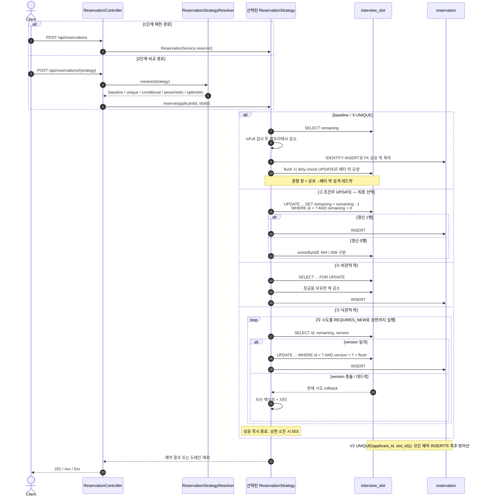

# 선착순 면접 예약 시스템 — 동시성 제어 실험

> 단순 예약 기능 구현이 아니라, **동시성 문제를 의도적으로 재현하고 여러 해결책을 비교 검증하는 실험형 프로젝트**입니다.

학부 시절 동아리 지원자 관리 서비스에서 면접 일정을 선착순으로 예약하는 기능을 만든 적이 있습니다. 당시엔 동시성 문제(중복 예약, 정원 초과)를 실제로 겪지 않았지만, 돌이켜보면 언제 터져도 이상하지 않은 코드였습니다. 운이 좋았을 뿐입니다. 이 프로젝트는 그 코드를 **제대로 다시 만드는** 리벤지 프로젝트입니다. 문제를 직접 재현하고, 여러 해결책을 비교 검증하며, 근거를 가지고 최종 방식을 선택하는 과정 전체를 기록합니다.

전체 기획은 [`PROJECT_PLAN.md`](PROJECT_PLAN.md), 데이터 모델은 [`docs/ERD.md`](docs/ERD.md)에 있습니다.

---

## 다루는 문제

동시성 문제를 **두 종류로 분리**하는 것이 이 프로젝트의 출발점입니다. 둘은 원인도 해결책도 다릅니다.

| 문제 | 원인 | 해결책 |
|---|---|---|
| 같은 사용자가 요청을 두 번 보냄 (더블클릭, 네트워크 재시도) | 요청 자체의 중복 | 요청의 정체성을 고정하는 키 — 여기서는 자연 키 `UNIQUE(applicant_id, slot_id)` |
| 다른 사용자들이 동시에 마지막 자리를 두고 경쟁 | 데이터 레이스 컨디션 | 조건부 UPDATE / 락 |

락만 구현하면 경쟁은 막아도 중복 요청은 못 막습니다. 실무에서는 이 두 문제가 항상 함께 옵니다.

기획 당시에는 위 첫 행의 해법으로 **멱등성 키**를 넣을 계획이었지만, 실제로 ①을 구현하고 나서 **도입하지 않기로 판단했습니다.** 이 도메인에서는 (지원자, 슬롯) 쌍이 그 자체로 요청의 정체성이라 클라이언트가 별도 키를 발급할 이유가 없기 때문입니다. 멱등성 키가 꼭 필요한 것은 결제·송금처럼 *요청 내용만으로 "같은 요청"인지 판별할 수 없는* 연산입니다. ([판단 근거 전문](docs/STEP2-3-BRANCH-STRATEGY.md#skip-idempotency-key))

## 방어 전략 (가벼운 것부터)

핵심 서사는 `가장 단순한 도구에서 시작했고, 그것이 부족해지는 지점에서만 더 무거운 도구를 꺼냈다`입니다.

| 순서 | 방어 수단 | 막는 문제 |
|---|---|---|
| 1 | `UNIQUE(applicant_id, slot_id)` | 중복 예약 (DB 레벨 최후 방어선) — 자연 키가 멱등성 키를 겸합니다 |
| 2 | 조건부 `UPDATE ... WHERE remaining > 0` | 정원 초과(오버부킹) |
| ~~3~~ | ~~멱등성 키~~ | **생략** — 1이 같은 문제를 이미 덮습니다 ([근거](docs/STEP2-3-BRANCH-STRATEGY.md#skip-idempotency-key)) |
| 3 | 비관적 락 / 낙관적 락 | 여러 단계·여러 테이블에 걸친 복잡한 트랜잭션 |
| ~~4~~ | ~~분산 락 (Redisson)~~ | **생략** — 임계 구역이 DB 밖으로 나가지 않습니다 ([근거](docs/STEP2-3-BRANCH-STRATEGY.md#skip-distributed-lock)) |

락(비관적 / 낙관적)은 **조건부 UPDATE만으로 부족해지는 지점을 보여주기 위해** 배치합니다. 처음부터, 그리고 끝내 분산 락을 꺼내지 않은 이유와 최종적으로 무엇을 왜 선택했는지가 이 프로젝트의 핵심 논증입니다. (근거 정리: 아래 [트레이드오프 분석](#트레이드오프-분석) 참조)

**분산 락은 구현하지 않기로 판단했습니다(2026-09-04).** 분산 락은 동시성 제어를 **데이터베이스 하나로 끝낼 수 없을 때** — 임계 구역 안에서 외부 결제 API, 다른 서비스의 DB, 정확히 한 번만 보내야 하는 알림처럼 **DB 밖의 것까지 함께** 조율해야 할 때 — 쓰는 도구입니다. 이 도메인의 임계 구역은 슬롯 한 행의 `UPDATE` 하나이고 공유 상태는 단일 MySQL 한 곳에만 있으므로, 서버 인스턴스를 늘려도 그 명분이 생기지 않습니다. ([판단 근거 전문](docs/STEP2-3-BRANCH-STRATEGY.md#skip-distributed-lock))

## 기술 스택

| 구분 | 기술 |
|---|---|
| 언어 / 프레임워크 | Java 21, Spring Boot 3.5.16 |
| ORM | Spring Data JPA |
| DB | MySQL 8.0 |
| 캐시 | Redis 7 (컨테이너만 기동 — 분산 락 생략으로 2단계에서는 사용처가 없습니다) |
| 부하 테스트 | Gatling (1단계 문제 재현부터 도입) |
| 빌드 | Gradle (wrapper) |

---

## 로컬 실행 방법

**요구사항**: JDK 21, Docker.

```bash
# 1. MySQL + Redis 기동
docker compose up -d
docker compose ps          # 두 컨테이너가 healthy 인지 확인

# 2. 빌드 + 테스트
./gradlew build            # PowerShell/cmd 에서는 gradlew.bat

# 3. 앱 실행
./gradlew bootRun
```

접속 기본값은 `application.yml`에 맞춰져 있어 컨테이너만 띄우면 그대로 붙습니다. 포트 등을 바꾸려면 환경변수(`DB_HOST`, `DB_PORT`, `DB_NAME`, `DB_USERNAME`, `DB_PASSWORD`, `REDIS_HOST`, `REDIS_PORT`)로 덮어쓰면 됩니다. 실험을 같은 조건에서 다시 돌리려면 `docker compose down -v`로 볼륨까지 초기화합니다.

정원 경쟁 벤치마크는 [`scripts/benchmark_capacity.py`](scripts/benchmark_capacity.py)가 Williams 실행 순서·환경 검증·Gatling·DB 정합성·CSV 기록을 담당하고, [`scripts/summarize_benchmark.py`](scripts/summarize_benchmark.py)가 완전한 Phase A+B만 검증해 표와 차트를 만듭니다. 두 번의 앱 기동을 포함한 전체 재현 명령은 [벤치마크 문서 9절](docs/STEP2-DEFENSE-BENCHMARK.md#9-재현)에 있습니다.

## 스키마

스키마는 Hibernate가 생성하지 않고(`ddl-auto: validate`) **Flyway 마이그레이션으로 버전 관리**합니다. 방어 수단이 단계별로 하나씩 들어오는 과정 자체가 이 프로젝트의 논지이므로, 그 과정이 마이그레이션 이력에 남아야 하기 때문입니다. 테스트도 동일한 마이그레이션을 사용합니다 — 제약이 실제로 지켜지는지가 곧 측정 대상이라, 테스트가 다른 스키마를 보면 안 됩니다.

| 버전 | 내용 | 단계 |
|---|---|---|
| `V1__baseline_schema_without_guards.sql` | applicant / interview_slot / reservation. **방어 제약 없음** | 1단계 |
| `V2__add_unique_reservation.sql` | `UNIQUE(applicant_id, slot_id)` — 중복 예약 차단 | 2-1단계 ① |
| `V3__add_version_to_slot.sql` | `interview_slot.version` (낙관적 락) | 2-2단계 ⑤ |

② 조건부 UPDATE는 스키마 변경이 없고, ③ 멱등성 키는 생략했으므로 `V3`은 낙관적 락 몫으로 확정입니다.

테이블 정의와 설계 근거는 [`docs/ERD.md`](docs/ERD.md)에 있습니다.

---

## 실험 결과

> **1단계(방어 없음) 완료 · 2단계 벤치마크 완료 · 3단계 최종 선택 완료.** 현재 정본은
> 2026-09-25의 방법론 v2 Williams 캠페인 `2026-09-25-williams-v2-01`입니다. Phase마다 10개 처리 조합을 Williams 순서로
> 균형 배치하고 10라운드씩, 두 번의 검증된 애플리케이션 기동에서 총 200회를 측정했습니다.
> 전체 해석은 [`docs/STEP2-DEFENSE-BENCHMARK.md`](docs/STEP2-DEFENSE-BENCHMARK.md), 원시 정본은
> [`raw-runs-v2.csv`](docs/benchmark/raw-runs-v2.csv), 실행 추적은 [성공 캠페인
> 매니페스트](docs/benchmark/campaigns/2026-09-25-williams-v2-01/manifest.md)와
> [Phase A](docs/benchmark/campaigns/2026-09-25-williams-v2-01/environment-phase-a.json) ·
> [Phase B](docs/benchmark/campaigns/2026-09-25-williams-v2-01/environment-phase-b.json) 환경 스냅샷에
> 있습니다. 2026-09-24의 고정 순서 60회는 변경 불가한 `methodology-v1-fixed-order`
> [원시 자료](docs/benchmark/raw-runs.csv)와 [실행 기록](docs/benchmark/2026-09-24-controlled-run.md)으로,
> 그 이전 기본 프로필 결과는 [별도 아카이브](docs/benchmark/archive/2026-09-04-manifest.md)로만 보존합니다.

### 1단계 — 방어 없는 baseline에서 무엇이 깨졌나

락 없는 `POST /api/reservations`에 **정원 100 슬롯 하나 vs 서로 다른 지원자 500명**을 `atOnceUsers(500)`로 한꺼번에 태우면, 세 가지 실패 모드가 **한 실행에서 동시에** 드러납니다.

- **오버부킹** — 확정 예약 113건 > 정원 100 (13건 초과).
- **lost update** — 카운터 `remaining`이 60번만 감소해 40에 갇힘(확정은 113건). 예약 행 수와 카운터가 서로 다른 값으로 둘 다 틀림.
- **데드락 폭증** — `reserve` 요청의 77%(387/500)가 HTTP 500. `reservation → interview_slot` FK의 S→X 잠금 승격 데드락.
- **가장 날카로운 관찰** — 409(정원 마감)가 **0건**. lost update로 카운터가 0에 닿지 못해, 앱은 슬롯이 꽉 찼다는 사실 자체를 인지하지 못함.

두 단계로 재현했습니다. 서비스 계층에서는 트랜잭션이 1ms 미만이라 **간헐적으로만**(15명 경쟁 시 3~8/10 라운드) 터지고, HTTP 지연이 경쟁 창을 넓히자 **상시**로 드러났습니다. 상세 근거·인터리빙 다이어그램은 [서비스-계층 재현](docs/STEP1-BASELINE-OVERBOOKING.md)과 [Gatling HTTP 부하](docs/STEP1-GATLING-LOADTEST.md)에 있습니다.

### Before / After 부하 테스트

방어 5종을 두 경합 지점에서 Phase당 10회씩 측정했습니다. 한 Phase의 10개
`전략 × 경합` 처리는 매 라운드 Williams 균형 순서로 배치했습니다. Phase A는 낙관적 락 재시도 상한
5, Phase B는 상한 20인 **서로 다른 애플리케이션 기동**입니다. 따라서 각 상한은 같은 Phase의
대조 전략과 비교하고, 상한 5와 20의 차이는 앱 기동 간 민감도 분석으로만 읽습니다.

각 성능 셀은 **개별 실행값의 중앙값 (min–max)** 이며 TPS는 Gatling 전체 실행 시간이 아니라 동시
요청 버스트 구간에서 계산했습니다. OK는 시나리오가 허용한 HTTP 201/409를 함께 세므로 확정 예약
건수와 같지 않습니다. KO가 많은 행의 높은 TPS도 성공 작업 처리량이 아니므로 확정 예약, OK/KO,
정합성을 함께 봐야 합니다.

이 정원 경쟁 workload는 모든 요청에 서로 다른 지원자를 사용합니다. 아래 `중복 관찰값†`은 원시
스키마의 관찰값일 뿐, 동일 요청 중복 방어의 근거가 아닙니다.

**Phase A — 낙관적 락 상한 5 · 낮은 경합 `capacity=100`, `contenders=120`**

| 방식 | 확정 예약 중앙값 | 오버부킹 최댓값 | 중복 관찰값† | KO 중앙값 | 실행별 평균 응답의 중앙값 (min–max) | 실행별 p95의 중앙값 (min–max) | 버스트 TPS의 중앙값 (min–max) | n |
|---|---:|---:|---:|---:|---:|---:|---:|---:|
| 방어 없음 | 9 | 0 | 0 | 111 | 81.5ms (72–109) | 108.5ms (97–138) | 972.05 requests/s (784.3–1100.9) | 10 |
| ① UNIQUE | 8.5 | 0 | 0 | 111.5 | 81ms (74–102) | 116ms (94–142) | 934.55 requests/s (779.2–1111.1) | 10 |
| ② 조건부 UPDATE | 100 | 0 | 0 | 0 | 125.5ms (119–146) | 194ms (182–223) | 556.85 requests/s (466.9–594.1) | 10 |
| ④ 비관적 락 | 100 | 0 | 0 | 0 | 152ms (139–160) | 227.5ms (204–247) | 491.85 requests/s (444.4–526.3) | 10 |
| ⑤ 낙관적 락 (상한 5) | 12 | 0 | 0 | 108 | 267ms (251–276) | 318.5ms (302–340) | 347.8 requests/s (329.7–360.4) | 10 |

**Phase A — 낙관적 락 상한 5 · 극단 경합 `capacity=1`, `contenders=200`**

| 방식 | 확정 예약 중앙값 | 오버부킹 최댓값 | 중복 관찰값† | KO 중앙값 | 실행별 평균 응답의 중앙값 (min–max) | 실행별 p95의 중앙값 (min–max) | 버스트 TPS의 중앙값 (min–max) | n |
|---|---:|---:|---:|---:|---:|---:|---:|---:|
| 방어 없음 | 3 | 2 | 0 | 12.5 | 77ms (66–88) | 111ms (100–121) | 1492.5 requests/s (1398.6–1652.9) | 10 |
| ① UNIQUE | 3 | 2 | 0 | 10 | 73ms (65–79) | 109ms (105–112) | 1606.65 requests/s (1418.4–1709.4) | 10 |
| ② 조건부 UPDATE | 1 | 0 | 0 | 0 | 117ms (109–164) | 180ms (162–233) | 939.05 requests/s (738–1015.2) | 10 |
| ④ 비관적 락 | 1 | 0 | 0 | 0 | 88.5ms (76–95) | 127.5ms (114–138) | 1320.15 requests/s (1156.1–1459.9) | 10 |
| ⑤ 낙관적 락 (상한 5) | 1 | 0 | 0 | 0 | 70ms (67–84) | 100ms (95–121) | 1688.05 requests/s (1398.6–1851.9) | 10 |

**Phase B — 낙관적 락 상한 20 · 낮은 경합 `capacity=100`, `contenders=120`**

| 방식 | 확정 예약 중앙값 | 오버부킹 최댓값 | 중복 관찰값† | KO 중앙값 | 실행별 평균 응답의 중앙값 (min–max) | 실행별 p95의 중앙값 (min–max) | 버스트 TPS의 중앙값 (min–max) | n |
|---|---:|---:|---:|---:|---:|---:|---:|---:|
| 방어 없음 | 8 | 0 | 0 | 112 | 78ms (70–87) | 106ms (93–129) | 1025.6 requests/s (845.1–1090.9) | 10 |
| ① UNIQUE | 8.5 | 0 | 0 | 111.5 | 82ms (71–87) | 103ms (94–119) | 1004.2 requests/s (851.1–1142.9) | 10 |
| ② 조건부 UPDATE | 100 | 0 | 0 | 0 | 126ms (119–142) | 192.5ms (180–208) | 563.4 requests/s (526.3–594.1) | 10 |
| ④ 비관적 락 | 100 | 0 | 0 | 0 | 140ms (134–166) | 212.5ms (201–308) | 510.6 requests/s (369.2–531) | 10 |
| ⑤ 낙관적 락 (상한 20) | 100 | 0 | 0 | 0 | 483ms (461–531) | 774ms (711–842) | 139.5 requests/s (131.3–149.1) | 10 |

**Phase B — 낙관적 락 상한 20 · 극단 경합 `capacity=1`, `contenders=200`**

| 방식 | 확정 예약 중앙값 | 오버부킹 최댓값 | 중복 관찰값† | KO 중앙값 | 실행별 평균 응답의 중앙값 (min–max) | 실행별 p95의 중앙값 (min–max) | 버스트 TPS의 중앙값 (min–max) | n |
|---|---:|---:|---:|---:|---:|---:|---:|---:|
| 방어 없음 | 3 | 2 | 0 | 13 | 75.5ms (64–89) | 105ms (94–117) | 1653.35 requests/s (1481.5–1709.4) | 10 |
| ① UNIQUE | 3 | 2 | 0 | 12 | 78ms (72–92) | 115.5ms (107–125) | 1487.2 requests/s (1398.6–1652.9) | 10 |
| ② 조건부 UPDATE | 1 | 0 | 0 | 0 | 122.5ms (109–142) | 188ms (161–209) | 913.25 requests/s (809.7–970.9) | 10 |
| ④ 비관적 락 | 1 | 0 | 0 | 0 | 97.5ms (87–137) | 140ms (125–187) | 1190.85 requests/s (877.2–1307.2) | 10 |
| ⑤ 낙관적 락 (상한 20) | 1 | 0 | 0 | 0 | 73ms (64–81) | 103.5ms (95–117) | 1639.8 requests/s (1459.9–1851.9) | 10 |

> 1단계 문서의 `contenders=500` 수치와는 **부하 조건이 다릅니다.** ⑦은 ④⑤와 조건을 맞추기 위해 위 두 지점으로 통일했습니다. 또한 Phase 사이에는 앱 기동과 실행 시점이 달라, A/B 숫자를 동일 프로세스의 짝비교로 해석하지 않습니다.

### 2단계 — 방어를 하나씩 넣으며 관찰한 것

`POST /api/reservations/{strategy}`로 방어별 경로를 나란히 두어(baseline은 보존) 같은 부하로 비교할 수 있게 했습니다.

- **① UNIQUE 제약** — 같은 (지원자, 슬롯) 중복 예약은 애플리케이션에 락이 없어도 DB가 **매번** 막습니다. 다만 서로 다른 지원자의 정원 경쟁은 (지원자, 슬롯) 쌍이 매번 달라 **오버부킹을 전혀 막지 못합니다.** ([상세](docs/STEP2-UNIQUE-CONSTRAINT.md))
- **② 조건부 UPDATE** — `UPDATE ... SET remaining = remaining - 1 WHERE id = ? AND remaining > 0` **한 문장**으로 오버부킹이 **결정적으로 0**이 됩니다. 애플리케이션의 명시적 잠금 조회나 재시도가 없습니다. UPDATE 자체는 InnoDB 행 잠금을 사용하므로 “무잠금”이나 데드락 가능성 0으로 일반화하지 않습니다. baseline의 "간헐적으로 터짐"과 정면 대비되는 지점입니다. ([상세](docs/STEP2-CONDITIONAL-UPDATE.md))

- **③ 멱등성 키 — 도입하지 않기로 판단** — 기획서에는 3순위 방어로 올려뒀지만, ①을 끝내고 다시 따져 보니 이 도메인에서는 **(지원자, 슬롯) 쌍이 그 자체로 요청의 정체성**이라 클라이언트가 별도 키를 발급할 이유가 없었습니다. 자연 키가 이미 멱등성 키이고, 거기엔 ①의 UNIQUE가 걸려 있습니다. 자연 키로 충분한 자리에 Redis `SETNX`를 얹는 것은 "가벼운 것부터"라는 이 프로젝트의 논지를 스스로 배반하는 일이라 판단해 생략했습니다. ([판단 근거](docs/STEP2-3-BRANCH-STRATEGY.md#skip-idempotency-key))

- **④ 비관적 락 — 오버부킹은 막지만 채택하지 않음** — `SELECT ... FOR UPDATE`도 오버부킹을 결정적으로 0으로 만듭니다. v2의 낮은 경합에서 평균 응답 중앙값은 Phase A/B 각각 ② 125.5/126ms, ④ 152/140ms였고 Phase 내부 라운드 비교도 두 Phase 모두 ②가 9/10 앞섰습니다. 극단 경합에서는 ② 117/122.5ms, ④ 88.5/97.5ms였고 ④가 Phase A 10/10, Phase B 9/10 앞섰습니다. 다만 한 라운드 안에서도 두 실행의 직렬 위치와 시점은 달라 이 차이를 락 하나의 인과 효과로 단정하지 않습니다. **락이 보편적으로 느리다는 근거로 배제하지도 않습니다.** 현재 불변식이 단일 행의 `remaining > 0` 조건과 감소 한 문장으로 표현되므로, 더 작은 상태 전이인 ②를 선택합니다. 만석 중심 SLO라면 ④는 유효 후보이며 `existsById` A/B 후 다시 비교해야 합니다. ([구현 당시 예비 측정](docs/STEP2-PESSIMISTIC-LOCK.md) · [v2 종합](docs/STEP2-DEFENSE-BENCHMARK.md#conditional-vs-pessimistic))

- **⑤ 낙관적 락 — 오버부킹은 막지만 채택하지 않음** — `@Version` + 백오프 재시도도 오버부킹을 0으로 만듭니다. 그러나 낙관적 락의 경합은 요청 수보다 **같은 행에 성공적으로 쓰는 횟수**에 좌우돼, `capacity=100`이 ⑤에게 최악입니다. Phase A의 상한 5는 확정 예약 중앙값 12, 재시도 소진 108건(103–110), 버전 충돌 568회(562–572)였습니다. 같은 Phase의 ②는 100석을 채우고 KO가 0이었습니다. Phase B의 상한 20은 100석을 채우고 KO 0이었지만 평균 응답 중앙값 483ms(461–531), p95 774ms(711–842), 버스트 TPS 139.5(131.3–149.1)였고, 같은 Phase의 ②는 각각 126ms(119–142), 192.5ms(180–208), 563.4(526.3–594.1)였습니다. 상한 5/20은 서로 다른 앱 기동의 민감도 분석이지 동일 프로세스 짝비교가 아닙니다. ([구현·백오프](docs/STEP2-OPTIMISTIC-LOCK.md) · [v2 종합](docs/STEP2-DEFENSE-BENCHMARK.md#optimistic-sensitivity))

- **⑥ 분산 락 — 도입하지 않기로 판단** — 분산 락은 동시성 제어가 **DB 하나로 끝나지 않을 때** 쓰는 도구입니다. 임계 구역에 외부 결제 API·다른 저장소·정확히 한 번 보내야 하는 알림이 들어와야 DB 트랜잭션의 원자성이 닿지 못하는 구간이 생기고, 그때 비로소 애플리케이션 레벨 뮤텍스가 필요합니다. 이 도메인에는 그 구간이 없습니다 — 임계 구역은 슬롯 한 행의 UPDATE 하나이고, 공유 상태는 단일 MySQL 한 곳뿐이라 인스턴스를 늘려도 마찬가지입니다. 같은 시나리오에서 구현했다면 결과는 "오버부킹 0(②·④·⑤와 동률) + Redis 왕복만큼 더 느림"으로 정해져 있고, 그 숫자는 분산 락에 대해 아무것도 증명하지 못합니다. ([판단 근거](docs/STEP2-3-BRANCH-STRATEGY.md#skip-distributed-lock))

- **⑦ 벤치마크 — Williams 균형 순서로 200회 재측정** — 전용 프로필의 풀·로그 설정을 고정한 뒤, 10개 처리를 Williams 순서로 균형 배치해 Phase당 10라운드씩 측정했습니다. 새 정본은 (1) baseline·①이 두 Phase의 극단 경합에서 오버부킹 최댓값 2, (2) baseline·①의 낮은 경합 확정 예약이 중앙값 8~9석에 그치고 KO 중앙값이 111~112, (3) ②·④는 두 Phase와 두 경합 모두 정합성·가용성을 충족하지만 성능 방향은 경합 지점에 따라 달라진다는 사실을 보여줍니다. `existsById`는 극단 결과와 방향이 맞는 가설이지만 분리 A/B 전에는 인과로 단정하지 않습니다. ([상세](docs/STEP2-DEFENSE-BENCHMARK.md))

여기서 나온 정직한 발견 하나: **락은 오버부킹을 조건부 UPDATE가 "못 막아서" 꺼내는 것이 아닙니다.** 이 문제 모양(단일 행 · 산술 델타 · 한 컬럼 가드)에서는 조건부 UPDATE가 불변식을 가장 작게 표현합니다. 그렇다고 항상 더 빠른 것도 아닙니다. v2에서 ②는 낮은 경합, ④는 극단 경합의 관측값이 더 작았고 두 실행의 위치·시점 차이가 남습니다. 락은 다중 행 불변식이나 애플리케이션 계산처럼 한 조건부 DML로 접을 수 없을 때 우선 검토하고, DB 밖 임계 구역은 이 도메인에 없으므로 ⑥을 구현하는 대신 **전제로 남겼습니다.**

### 아키텍처 다이어그램

1단계의 락 없는 경로는 재현 자산으로 보존하고, 2단계의 방어는 `ReservationStrategy` 구현체로 나란히 추가했습니다. `POST /api/reservations/{strategy}`가 같은 요청을 각 전략으로 보내므로, 방어 수단만 바꾼 before/after 비교가 가능합니다.



`UNIQUE`는 `/unique` 경로에만 존재하는 장치가 아니라 `reservation` 테이블 전체에 적용됩니다. `/unique` 경로는 그 제약 위반을 명시적으로 409로 번역하는 실험 경로이고, 최종 선택인 `/conditional`도 같은 DB 제약으로 데이터는 보호됩니다. 다만 `/conditional`은 아직 중복 제약 예외를 도메인 응답으로 번역하지 않습니다. 자리가 남아 INSERT까지 가면 처리되지 않은 제약 예외로 500, 이미 만석이면 INSERT 전에 409가 되어 응답이 상태에 따라 달라지므로 아래 후속 과제로 분리했습니다. 낙관적 락만 동일 테이블의 `version` 컬럼을 사용하는 별도 엔티티 매핑을 거치며, 충돌한 시도를 새 트랜잭션으로 다시 실행합니다.

### 트레이드오프 분석

#### 최종 선택 — `UNIQUE` + 조건부 UPDATE

두 장치는 경쟁 관계가 아니라 **서로 다른 불변식**을 맡습니다. `UNIQUE(applicant_id, slot_id)`는 같은 지원자·같은 슬롯의 중복 예약을 DB에서 차단하고, 조건부 `UPDATE`는 서로 다른 지원자가 마지막 자리를 두고 경쟁할 때 정원 확인과 감소를 SQL 한 문장으로 묶습니다.

v2의 200회 정원 경쟁 부하에서 조건부 UPDATE는 두 Phase·두 경합 지점 모두 **오버부킹 0, KO 0**이었고 정원도 전부 채웠습니다. 동일 요청 중복 방어는 이 부하가 아니라 ①의 전용 동시성 테스트 근거로 판단합니다. 낮은 경합 평균 응답 중앙값은 Phase A/B 125.5/126ms, 극단 경합은 117/122.5ms였습니다. ④보다 낮은 값이 관측된 낮은 경합과 반대인 극단 경합이 함께 있으므로 ②를 “성능 1위”로 선택하지 않습니다. 현재 도메인의 모양인 **단일 슬롯 행 · 단순 산술 차감 · `remaining > 0` 한 컬럼 가드**를 한 DML로 직접 표현하는 가장 작은 메커니즘이라 선택합니다. 전체 측정 조건과 원시 수치는 [⑦ 방어 전략 벤치마크](docs/STEP2-DEFENSE-BENCHMARK.md)에 있습니다.

| 수단 | 맡는 문제와 실측 비용 | 이 프로젝트의 판단 | 다시 검토할 경계 |
|---|---|---|---|
| ① `UNIQUE` | 동일 `(applicant_id, slot_id)` 중복은 막지만, 서로 다른 지원자의 정원 경쟁에는 무력했습니다. 두 Phase의 극단 경합에서 확정 예약 중앙값 3, 오버부킹 최댓값 2였습니다. | **유지.** ②의 대체재가 아니라 중복 전용 직교 방어입니다. | 자연 키가 사라지는 복수 예약이나 결제처럼 같은 내용의 요청을 별개로 식별해야 할 때 멱등성 키를 검토합니다. |
| ② 조건부 UPDATE | 두 지점 모두 정합성과 가용성을 충족했고, 별도 스키마·재시도 상한·추가 인프라가 없습니다. | **채택.** 현재 불변식을 표현하는 가장 작은 도구입니다. | 다중 행 불변식, 애플리케이션 계산, 여러 단계 트랜잭션 때문에 한 SQL 문으로 접을 수 없을 때입니다. |
| ④ 비관적 락 | 정합성·가용성은 ②와 같았습니다. 낮은 경합 평균 응답 중앙값은 Phase A/B 152/140ms로 ②의 125.5/126ms보다 컸고, 극단 경합은 88.5/97.5ms로 ②의 117/122.5ms보다 작았습니다. Phase 내부 짝도 같은 방향이지만 직렬 위치·시점 차이는 남습니다. | **미채택.** 보편적 성능 열세 때문이 아니라 현재 불변식에 명시적 read→check→decrease 잠금 구간이 필요 없기 때문입니다. 만석 중심 SLO라면 재검토합니다. | 충돌이 많고, 다단계·다중 행 불변식을 한 트랜잭션에서 보호해야 하거나 극단 거절 지연이 핵심일 때입니다. |
| ⑤ 낙관적 락 | Phase A 상한 5는 낮은 경합 확정 예약 중앙값 12, 소진 108건(103–110), 충돌 568회(562–572)였습니다. Phase B 상한 20은 100석을 채웠지만 483ms(461–531)·139.5 TPS(131.3–149.1)였고, 같은 Phase ②는 126ms(119–142)·563.4 TPS(526.3–594.1)였습니다. 두 상한은 앱 기동 간 민감도 분석입니다. | **미채택.** 측정한 두 상한에서는 가용성이나 비용 중 하나를 잃었습니다. | 실제 충돌이 드물고 실패한 연산의 재시도가 값쌀 때입니다. |
| ③ 멱등성 키 | 자연 키가 요청의 정체성을 이미 고정하고 ①이 이를 강제하므로 별도 Redis 키는 같은 문제를 중복해서 풉니다. | **생략.** 생략 자체가 가벼운 해법부터 쓴다는 원칙의 결과입니다. | 결제·송금처럼 같은 내용도 서로 다른 요청일 수 있거나 한 지원자의 동일 슬롯 복수 예약을 허용할 때입니다. |
| ⑥ 분산 락 | 공유 상태와 임계 구역이 단일 MySQL의 한 행 UPDATE 안에서 끝납니다. 같은 실험에 Redis 왕복을 더해도 새로운 판단 근거가 생기지 않습니다. | **생략.** 애플리케이션 인스턴스 수만 늘어나는 것은 도입 근거가 아닙니다. | 외부 결제, 다른 저장소, 정확히 한 번 보내야 하는 알림처럼 DB 밖 자원까지 한 임계 구역에서 조율해야 할 때입니다. |

④가 극단 경합에서 더 작은 응답값을 보였다는 사실은 숨기지 않습니다. 성공 경로의 쿼리 수는 ②가 3개, ④가 4개지만 거절 경로는 ②가 3개, ④가 2개입니다. `capacity=1`에서는 200건 중 199건이 거절되므로, ②에만 붙는 **404/409 구분용 추가 조회**는 극단 결과와 방향이 맞습니다. 다만 해당 조회만 제거한 A/B가 없고 같은 라운드에서도 직렬 위치와 실행 시점이 달라 인과로 확정하지 않습니다. ②의 선택 근거는 성능 우위가 아니라 한 조건부 DML로 현재 불변식을 표현하는 단순성입니다.

#### 트래픽이 100배가 된다면

이 벤치마크는 노트북 한 대에서 각 Phase·처리를 10회 측정한 비교 실험이므로, 관측한 버스트 TPS를 100배 트래픽에 그대로 외삽하지 않습니다. 대신 병목과 도메인 경계가 실제로 어떻게 변했는지를 다시 측정합니다.

1. **도메인이 그대로라면 방어도 유지합니다.** 애플리케이션 인스턴스를 수평 확장해도 `remaining`의 공유 상태가 단일 MySQL에 있는 한 조건부 UPDATE와 UNIQUE의 원자성은 유지됩니다. 먼저 쓰기 DB의 처리 한계와 인기 슬롯 한 행의 핫스폿을 별도 부하 시험으로 측정하고, 애플리케이션 확장·읽기 경로 분리·DB 용량을 순서대로 검토합니다. 서로 독립적인 슬롯이 많다면 슬롯 키 기준 분할로 쓰기를 나눌 수 있지만, **한 인기 슬롯의 마지막 자리는 어떤 방식이든 직렬화**해야 하므로 분할로 없앨 수 없습니다. 이때는 admission control이나 대기열로 과부하를 흡수합니다. 읽기 복제본이나 캐시는 조회 부하는 줄여도 예약 쓰기의 정합성을 대신하지 않습니다.
2. **트랜잭션 모양이 바뀌면 DB 락을 다시 비교합니다.** 여러 슬롯이나 여러 테이블의 불변식을 함께 지켜야 하면 한 행 조건부 UPDATE만으로는 부족합니다. 충돌 빈도와 재시도 비용을 측정해, 충돌이 많고 임계 구역이 긴 경우에는 비관적 락을, 충돌이 드물고 재시도가 싼 경우에는 낙관적 락을 후보로 올립니다.
3. **임계 구역이 DB 밖으로 나갈 때만 분산 조율을 검토합니다.** 외부 결제 API·다른 저장소·정확히 한 번 처리해야 하는 알림이 예약 확정과 묶이면 단일 DB 트랜잭션의 범위를 벗어납니다. 그때 outbox·사가 같은 경계 설계와 함께 분산 락의 TTL·watchdog·fencing token까지 비교합니다. 단순히 서버가 여러 대라는 이유만으로 Redis 락을 추가하지 않습니다.

#### 의도적으로 남긴 두 후속 과제

- **만석 거절 경로 A/B:** 현재 ②는 조건부 UPDATE가 0행이면 `existsById`로 없는 슬롯(404)과 만석(409)을 구분합니다. 이를 제거하면 쿼리는 3개에서 2개로 줄지만 API 의미도 함께 바뀝니다. v2 200회 표의 측정 대상을 중간에 바꾸지 않기 위해 그대로 두었으며, 별도 실험에서 응답 계약을 먼저 정한 뒤 3→2쿼리 A/B로 ④의 극단 경합 우위가 사라지는지 확인합니다.
- **중복 재시도의 응답 의미:** UNIQUE는 두 번째 INSERT를 막고 트랜잭션을 롤백해 예약과 좌석 수를 정확하게 유지합니다. 그러나 응답은 경로와 남은 좌석에 따라 다릅니다. `/unique`는 제약 위반을 잡아 409로 번역합니다. 최종 선택인 `/conditional`은 자리가 남으면 INSERT의 제약 예외가 처리되지 않아 500, 이미 만석이면 INSERT 전에 409로 끝납니다. 첫 성공 응답을 잃은 클라이언트에게 엄밀한 응답은 모두 `200 + 기존 예약`입니다. 이는 별도 멱등성 키가 필요한 동시성 결함이 아니라, UNIQUE 위에서 기존 예약을 조회해 반환하는 API 응답 설계 과제로 분리합니다.

### 트러블슈팅 회고

_작성 예정 — 구현 과정에서 실제로 부딪힌 문제와 해결 과정._

---

## 진행 상황

- [x] **1단계** — 락 없는 기본 구현 + Gatling으로 정원 초과/중복 예약 재현·캡처 ([서비스 계층](docs/STEP1-BASELINE-OVERBOOKING.md) · [HTTP 부하](docs/STEP1-GATLING-LOADTEST.md))
- [x] **2단계** — 방어 수단 구현 및 벤치마크 — ① UNIQUE ✅ · ② 조건부 UPDATE ✅ · ③ 멱등성 키 ❌ 생략 · ④ 비관적 락 ✅ · ⑤ 낙관적 락 ✅ · ⑥ 분산 락 ❌ 생략 · ⑦ 벤치마크 ✅ ([결과](docs/STEP2-DEFENSE-BENCHMARK.md))
- [x] **3단계** — 트레이드오프 분석 및 최종 선택 문서화 ([결론](#트레이드오프-분석))
- [ ] **4단계** (선택) — 비동기 알림 분리, 동시성 통합 테스트, CI/CD, 배포

브랜치 단위 진행 상황과 다음 작업은 [`docs/STEP2-3-BRANCH-STRATEGY.md`](docs/STEP2-3-BRANCH-STRATEGY.md)가 정본입니다.
