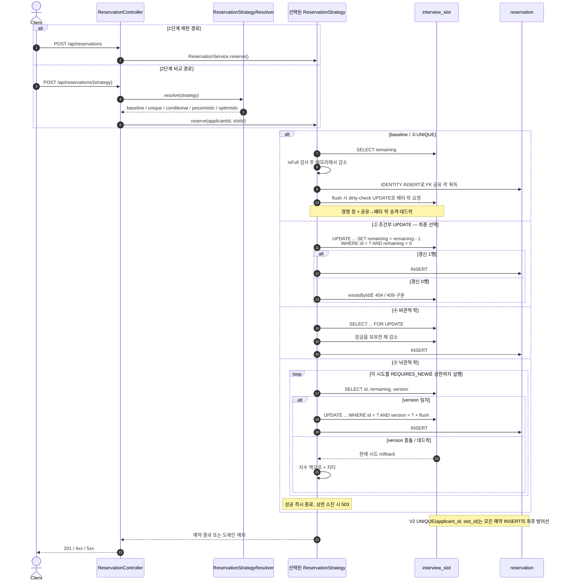

# 선착순 면접 예약 시스템 — 동시성 제어 실험

> 단순 예약 기능 구현이 아니라, **동시성 문제를 의도적으로 재현하고 여러 해결책을 비교 검증하는 실험형 프로젝트**입니다.

학부 시절 동아리 지원자 관리 서비스에서 면접 일정을 선착순으로 예약하는 기능을 만든 적이 있습니다. 당시엔 동시성 문제(중복 예약, 정원 초과)를 실제로 겪지 않았지만, 돌이켜보면 언제 터져도 이상하지 않은 코드였습니다. 운이 좋았을 뿐입니다. 이 프로젝트는 그 코드를 **제대로 다시 만드는** 리벤지 프로젝트입니다. 문제를 직접 재현하고, 여러 해결책을 비교 검증하며, 근거를 가지고 최종 방식을 선택하는 과정 전체를 기록합니다.

전체 기획은 [`PROJECT_PLAN.md`](PROJECT_PLAN.md), 데이터 모델은 [`docs/ERD.md`](docs/ERD.md)에 있습니다.

---

## 다루는 문제

동시성 문제를 **두 종류로 분리**하는 것이 이 프로젝트의 출발점입니다. 둘은 원인도 해결책도 다릅니다.

| 문제 | 원인 | 해결책 |
|---|---|---|
| 같은 사용자가 요청을 두 번 보냄 (더블클릭, 네트워크 재시도) | 요청 자체의 중복 | 요청의 정체성을 고정하는 키 — 여기서는 자연 키 `UNIQUE(applicant_id, slot_id)` |
| 다른 사용자들이 동시에 마지막 자리를 두고 경쟁 | 데이터 레이스 컨디션 | 조건부 UPDATE / 락 |

락만 구현하면 경쟁은 막아도 중복 요청은 못 막습니다. 실무에서는 이 두 문제가 항상 함께 옵니다.

기획 당시에는 위 첫 행의 해법으로 **멱등성 키**를 넣을 계획이었지만, 실제로 ①을 구현하고 나서 **도입하지 않기로 판단했습니다.** 이 도메인에서는 (지원자, 슬롯) 쌍이 그 자체로 요청의 정체성이라 클라이언트가 별도 키를 발급할 이유가 없기 때문입니다. 멱등성 키가 꼭 필요한 것은 결제·송금처럼 *요청 내용만으로 "같은 요청"인지 판별할 수 없는* 연산입니다. ([판단 근거 전문](docs/STEP2-3-BRANCH-STRATEGY.md#skip-idempotency-key))

## 방어 전략 (가벼운 것부터)

핵심 서사는 `가장 단순한 도구에서 시작했고, 그것이 부족해지는 지점에서만 더 무거운 도구를 꺼냈다`입니다.

| 순서 | 방어 수단 | 막는 문제 |
|---|---|---|
| 1 | `UNIQUE(applicant_id, slot_id)` | 중복 예약 (DB 레벨 최후 방어선) — 자연 키가 멱등성 키를 겸합니다 |
| 2 | 조건부 `UPDATE ... WHERE remaining > 0` | 정원 초과(오버부킹) |
| ~~3~~ | ~~멱등성 키~~ | **생략** — 1이 같은 문제를 이미 덮습니다 ([근거](docs/STEP2-3-BRANCH-STRATEGY.md#skip-idempotency-key)) |
| 3 | 비관적 락 / 낙관적 락 | 여러 단계·여러 테이블에 걸친 복잡한 트랜잭션 |
| ~~4~~ | ~~분산 락 (Redisson)~~ | **생략** — 임계 구역이 DB 밖으로 나가지 않습니다 ([근거](docs/STEP2-3-BRANCH-STRATEGY.md#skip-distributed-lock)) |

락(비관적 / 낙관적)은 **조건부 UPDATE만으로 부족해지는 지점을 보여주기 위해** 배치합니다. 처음부터, 그리고 끝내 분산 락을 꺼내지 않은 이유와 최종적으로 무엇을 왜 선택했는지가 이 프로젝트의 핵심 논증입니다. (근거 정리: 아래 [트레이드오프 분석](#트레이드오프-분석) 참조)

**분산 락은 구현하지 않기로 판단했습니다(2026-09-04).** 분산 락은 동시성 제어를 **데이터베이스 하나로 끝낼 수 없을 때** — 임계 구역 안에서 외부 결제 API, 다른 서비스의 DB, 정확히 한 번만 보내야 하는 알림처럼 **DB 밖의 것까지 함께** 조율해야 할 때 — 쓰는 도구입니다. 이 도메인의 임계 구역은 슬롯 한 행의 `UPDATE` 하나이고 공유 상태는 단일 MySQL 한 곳에만 있으므로, 서버 인스턴스를 늘려도 그 명분이 생기지 않습니다. ([판단 근거 전문](docs/STEP2-3-BRANCH-STRATEGY.md#skip-distributed-lock))

## 기술 스택

| 구분 | 기술 |
|---|---|
| 언어 / 프레임워크 | Java 21, Spring Boot 3.5.16 |
| ORM | Spring Data JPA |
| DB | MySQL 8.0 |
| 캐시 | Redis 7 (컨테이너만 기동 — 분산 락 생략으로 2단계에서는 사용처가 없습니다) |
| 부하 테스트 | Gatling (1단계 문제 재현부터 도입) |
| 빌드 | Gradle (wrapper) |

---

## 로컬 실행 방법

**요구사항**: JDK 21, Docker.

```bash
# 1. MySQL + Redis 기동
docker compose up -d
docker compose ps          # 두 컨테이너가 healthy 인지 확인

# 2. 빌드 + 테스트
./gradlew build            # PowerShell/cmd 에서는 gradlew.bat

# 3. 앱 실행
./gradlew bootRun
```

접속 기본값은 `application.yml`에 맞춰져 있어 컨테이너만 띄우면 그대로 붙습니다. 포트 등을 바꾸려면 환경변수(`DB_HOST`, `DB_PORT`, `DB_NAME`, `DB_USERNAME`, `DB_PASSWORD`, `REDIS_HOST`, `REDIS_PORT`)로 덮어쓰면 됩니다. 실험을 같은 조건에서 다시 돌리려면 `docker compose down -v`로 볼륨까지 초기화합니다.

## 스키마

스키마는 Hibernate가 생성하지 않고(`ddl-auto: validate`) **Flyway 마이그레이션으로 버전 관리**합니다. 방어 수단이 단계별로 하나씩 들어오는 과정 자체가 이 프로젝트의 논지이므로, 그 과정이 마이그레이션 이력에 남아야 하기 때문입니다. 테스트도 동일한 마이그레이션을 사용합니다 — 제약이 실제로 지켜지는지가 곧 측정 대상이라, 테스트가 다른 스키마를 보면 안 됩니다.

| 버전 | 내용 | 단계 |
|---|---|---|
| `V1__baseline_schema_without_guards.sql` | applicant / interview_slot / reservation. **방어 제약 없음** | 1단계 |
| `V2__add_unique_reservation.sql` | `UNIQUE(applicant_id, slot_id)` — 중복 예약 차단 | 2-1단계 ① |
| `V3__add_version_to_slot.sql` | `interview_slot.version` (낙관적 락) | 2-2단계 ⑤ |

② 조건부 UPDATE는 스키마 변경이 없고, ③ 멱등성 키는 생략했으므로 `V3`은 낙관적 락 몫으로 확정입니다.

테이블 정의와 설계 근거는 [`docs/ERD.md`](docs/ERD.md)에 있습니다.

---

## 실험 결과

> **1단계(방어 없음) 완료 · 2단계 벤치마크 완료 · 3단계 최종 선택 완료.** 방어 전체를 같은 조건에서 재측정한 ⑦ 벤치마크(60회)와 그 수치에 근거한 트레이드오프 분석까지 끝났습니다. 전체 수치와 측정 설계는 [`docs/STEP2-DEFENSE-BENCHMARK.md`](docs/STEP2-DEFENSE-BENCHMARK.md), 원시 측정치는 [`docs/benchmark/raw-runs.csv`](docs/benchmark/raw-runs.csv)에 있습니다.

### 1단계 — 방어 없는 baseline에서 무엇이 깨졌나

락 없는 `POST /api/reservations`에 **정원 100 슬롯 하나 vs 서로 다른 지원자 500명**을 `atOnceUsers(500)`로 한꺼번에 태우면, 세 가지 실패 모드가 **한 실행에서 동시에** 드러납니다.

- **오버부킹** — 확정 예약 113건 > 정원 100 (13건 초과).
- **lost update** — 카운터 `remaining`이 60번만 감소해 40에 갇힘(확정은 113건). 예약 행 수와 카운터가 서로 다른 값으로 둘 다 틀림.
- **데드락 폭증** — `reserve` 요청의 77%(387/500)가 HTTP 500. `reservation → interview_slot` FK의 S→X 잠금 승격 데드락.
- **가장 날카로운 관찰** — 409(정원 마감)가 **0건**. lost update로 카운터가 0에 닿지 못해, 앱은 슬롯이 꽉 찼다는 사실 자체를 인지하지 못함.

두 단계로 재현했습니다. 서비스 계층에서는 트랜잭션이 1ms 미만이라 **간헐적으로만**(15명 경쟁 시 3~8/10 라운드) 터지고, HTTP 지연이 경쟁 창을 넓히자 **상시**로 드러났습니다. 상세 근거·인터리빙 다이어그램은 [서비스-계층 재현](docs/STEP1-BASELINE-OVERBOOKING.md)과 [Gatling HTTP 부하](docs/STEP1-GATLING-LOADTEST.md)에 있습니다.

### Before / After 부하 테스트

방어 5종을 **같은 시나리오·같은 부하**로 두 경합 지점에서 각 5회, 총 60회 측정했습니다. 실행 순서는 라운드 단위 인터리브라 같은 라운드의 값끼리는 거의 같은 머신 상태에서 나온 것입니다. 응답시간은 **중앙값**이며 괄호는 min–max 범위입니다(노트북 1대 측정이라 절대치가 아니라 순서를 봅니다).

**낮은 경합 — `capacity=100`, `contenders=120`**

| 방식 | TPS | 응답시간 (중앙값 / p95) | KO | 데이터 정합성 |
|---|---|---|---|---|
| 방어 없음 | 474 | 144ms <sub>(103–193)</sub> / 240ms | **93/120** | ⚠️ 오버부킹은 0이지만 **77%가 데드락으로 죽어** 100석 중 27석만 참 |
| ① UNIQUE | 498 | 121ms <sub>(111–150)</sub> / 197ms | **94/120** | ⚠️ 위와 동일 — 중복은 막지만 정원 경쟁에는 무력 |
| ② 조건부 UPDATE | **536** | **130ms** <sub>(119–152)</sub> / 210ms | 0 | ✅ 오버부킹 0 · 중복 0 · **100석 전부** |
| ④ 비관적 락 | 486 | 155ms <sub>(143–157)</sub> / 241ms | 0 | ✅ 동일 (그러나 5/5 라운드에서 ②보다 느림) |
| ⑤ 낙관적 락 (상한 5) | 299 | 272ms <sub>(238–322)</sub> / 384ms | **68/120** | ⚠️ 오버부킹 0이지만 **52석만** 참 (68건 503) |
| ⑤ 낙관적 락 (상한 20) | **167** | **353ms** <sub>(326–389)</sub> / 636ms | 0 | ✅ 100석 전부 — 대신 TPS가 ②의 1/3 |

**극단 경합 — `capacity=1`, `contenders=200`**

| 방식 | TPS | 응답시간 (중앙값 / p95) | KO | 데이터 정합성 |
|---|---|---|---|---|
| 방어 없음 | 1299 | 86ms <sub>(67–110)</sub> / 136ms | 8 | ❌ **오버부킹 +2** (정원 1에 3건 확정, 5회 전부) |
| ① UNIQUE | 1471 | 83ms <sub>(78–117)</sub> / 128ms | 7 | ❌ **오버부킹 +2** — baseline과 동률 |
| ② 조건부 UPDATE | 877 | 128ms <sub>(104–150)</sub> / 211ms | 0 | ✅ 오버부킹 0 · 중복 0 |
| ④ 비관적 락 | 1087 | 98ms <sub>(79–112)</sub> / 152ms | 0 | ✅ 동일 |
| ⑤ 낙관적 락 (상한 5·20) | 1227 / 1351 | 88 / 74ms | 0 | ✅ 동일 |

> 1단계 문서의 `contenders=500` 수치와는 **부하 조건이 다릅니다.** ⑦은 ④⑤와 조건을 맞추기 위해 위 두 지점으로 통일했습니다.

### 2단계 — 방어를 하나씩 넣으며 관찰한 것

`POST /api/reservations/{strategy}`로 방어별 경로를 나란히 두어(baseline은 보존) 같은 부하로 비교할 수 있게 했습니다.

- **① UNIQUE 제약** — 같은 (지원자, 슬롯) 중복 예약은 애플리케이션에 락이 없어도 DB가 **매번** 막습니다. 다만 서로 다른 지원자의 정원 경쟁은 (지원자, 슬롯) 쌍이 매번 달라 **오버부킹을 전혀 막지 못합니다.** ([상세](docs/STEP2-UNIQUE-CONSTRAINT.md))
- **② 조건부 UPDATE** — `UPDATE ... SET remaining = remaining - 1 WHERE id = ? AND remaining > 0` **한 문장**으로 오버부킹이 **결정적으로 0**이 됩니다. 락도 데드락도 재시도도 없습니다. baseline의 "간헐적으로 터짐"과 정면 대비되는 지점입니다. ([상세](docs/STEP2-CONDITIONAL-UPDATE.md))

- **③ 멱등성 키 — 도입하지 않기로 판단** — 기획서에는 3순위 방어로 올려뒀지만, ①을 끝내고 다시 따져 보니 이 도메인에서는 **(지원자, 슬롯) 쌍이 그 자체로 요청의 정체성**이라 클라이언트가 별도 키를 발급할 이유가 없었습니다. 자연 키가 이미 멱등성 키이고, 거기엔 ①의 UNIQUE가 걸려 있습니다. 자연 키로 충분한 자리에 Redis `SETNX`를 얹는 것은 "가벼운 것부터"라는 이 프로젝트의 논지를 스스로 배반하는 일이라 판단해 생략했습니다. ([판단 근거](docs/STEP2-3-BRANCH-STRATEGY.md#skip-idempotency-key))

- **④ 비관적 락 — 오버부킹은 막지만 채택하지 않음** — `SELECT ... FOR UPDATE`도 오버부킹을 결정적으로 0으로 만듭니다. 하지만 그건 **②가 이미 달성한 결과**이고, 저경합에서는 7쌍 중 6쌍에서 ②가 더 빨랐습니다(중앙값 178 vs 279ms). **정합성이 동률이면 성능이 동률이기만 해도 락은 집니다** — 대기, 트랜잭션 결합, 데드락 위험이라는 구조적 비용을 대가 없이 치르기 때문입니다. 부수적으로 요청당 쿼리 수를 재보니 "락이 왕복을 더 쓴다"는 통념이 **경로마다 방향이 다르다**는 것도 확인했습니다(성공 3 vs 4, 거절 3 vs 2). ([상세](docs/STEP2-PESSIMISTIC-LOCK.md))

- **⑤ 낙관적 락 — 오버부킹은 막지만 채택하지 않음** — `@Version` + 백오프 재시도도 오버부킹을 0으로 만듭니다. 그러나 이 도메인의 경합 축에서 **가장 불리합니다.** 낙관적 락의 경합은 요청 수가 아니라 **같은 행에 성공적으로 쓰는 횟수**로 정해지기 때문에, 다른 전략에게 "낮은 경합"인 `capacity=100` 지점이 ⑤에게는 최악입니다(버전 충돌 437~492회 vs 극단 경합에서 9회). 재시도 상한에 **고를 만한 값이 아예 없다**는 것도 실측됐습니다 — 상한 5는 100석 중 52석만 채우고, 상한 20은 다 채우는 대신 TPS가 ②의 1/3이 됩니다. 백오프 방식(고정·지수·지수+지터)은 원리가 아니라 **실측으로** 골랐습니다. ([상세](docs/STEP2-OPTIMISTIC-LOCK.md))

- **⑥ 분산 락 — 도입하지 않기로 판단** — 분산 락은 동시성 제어가 **DB 하나로 끝나지 않을 때** 쓰는 도구입니다. 임계 구역에 외부 결제 API·다른 저장소·정확히 한 번 보내야 하는 알림이 들어와야 DB 트랜잭션의 원자성이 닿지 못하는 구간이 생기고, 그때 비로소 애플리케이션 레벨 뮤텍스가 필요합니다. 이 도메인에는 그 구간이 없습니다 — 임계 구역은 슬롯 한 행의 UPDATE 하나이고, 공유 상태는 단일 MySQL 한 곳뿐이라 인스턴스를 늘려도 마찬가지입니다. 같은 시나리오에서 구현했다면 결과는 "오버부킹 0(②·④·⑤와 동률) + Redis 왕복만큼 더 느림"으로 정해져 있고, 그 숫자는 분산 락에 대해 아무것도 증명하지 못합니다. ([판단 근거](docs/STEP2-3-BRANCH-STRATEGY.md#skip-distributed-lock))

- **⑦ 벤치마크 — 같은 부하로 60회** — 위 표가 그 결과입니다. 세 가지가 새로 확인됐습니다. (1) **①이 오버부킹을 막지 못한다**는 그동안의 서술이 처음으로 부하 실측으로 확인됐습니다(정원 1에 3건 확정, 5회 전부). (2) **baseline의 "낮은 경합 오버부킹 0"은 방어가 아니라 데드락에 가려진 것**입니다 — 요청의 77%가 죽어 넘칠 만큼 도달하지 못했을 뿐입니다. 데드락이 줄어드는 극단 경합에서 비로소 오버부킹이 드러나는데, 두 실패 모드가 서로를 가리고 있었다는 뜻입니다. (3) ④가 *"메커니즘은 실재하지만 이 측정으로는 확정할 수 없다"*고 남긴 ②vs④ 비교가 갈렸습니다 — **낮은 경합은 ② 5/5승, 극단 경합은 ④ 4/5승**으로 경로에 따라 방향이 실제로 뒤집힙니다. 다만 그 원인은 ②의 `existsById` 추가 왕복이라 **방어의 한계가 아니라 구현 여지**입니다. ([상세](docs/STEP2-DEFENSE-BENCHMARK.md))

여기서 나온 정직한 발견 하나: **락은 오버부킹을 조건부 UPDATE가 "못 막아서" 꺼내는 것이 아닙니다.** 이 문제 모양(단일 행 · 산술 델타 · 한 컬럼 가드)에서는 조건부 UPDATE가 사실상 최적해이고, 락은 그 세 조건이 깨질 때(다중 행 불변식, 앱에서 계산하는 값, DB 밖으로 나가는 임계 구역)에만 값을 합니다. ④⑤는 그 경계를 실증하는 대조군이고, 세 번째 경우(DB 밖으로 나가는 임계 구역)는 이 도메인에 없으므로 ⑥을 구현하는 대신 **전제로 남겼습니다.**

### 아키텍처 다이어그램

1단계의 락 없는 경로는 재현 자산으로 보존하고, 2단계의 방어는 `ReservationStrategy` 구현체로 나란히 추가했습니다. `POST /api/reservations/{strategy}`가 같은 요청을 각 전략으로 보내므로, 방어 수단만 바꾼 before/after 비교가 가능합니다.



`UNIQUE`는 `/unique` 경로에만 존재하는 장치가 아니라 `reservation` 테이블 전체에 적용됩니다. `/unique` 경로는 그 제약 위반을 명시적으로 409로 번역하는 실험 경로이고, 최종 선택인 `/conditional`도 같은 DB 제약으로 데이터는 보호됩니다. 다만 `/conditional`은 아직 중복 제약 예외를 도메인 응답으로 번역하지 않습니다. 자리가 남아 INSERT까지 가면 처리되지 않은 제약 예외로 500, 이미 만석이면 INSERT 전에 409가 되어 응답이 상태에 따라 달라지므로 아래 후속 과제로 분리했습니다. 낙관적 락만 동일 테이블의 `version` 컬럼을 사용하는 별도 엔티티 매핑을 거치며, 충돌한 시도를 새 트랜잭션으로 다시 실행합니다.

### 트레이드오프 분석

#### 최종 선택 — `UNIQUE` + 조건부 UPDATE

두 장치는 경쟁 관계가 아니라 **서로 다른 불변식**을 맡습니다. `UNIQUE(applicant_id, slot_id)`는 같은 지원자·같은 슬롯의 중복 예약을 DB에서 차단하고, 조건부 `UPDATE`는 서로 다른 지원자가 마지막 자리를 두고 경쟁할 때 정원 확인과 감소를 SQL 한 문장으로 묶습니다.

동일한 부하를 60회 인가한 결과, 조건부 UPDATE는 두 경합 지점 모두 **오버부킹 0, 중복 0, KO 0**이었고 정원도 전부 채웠습니다. 특히 `capacity=100`, `contenders=120`에서는 535.7 TPS와 평균 응답시간 중앙값 130ms로 정합성이 같은 후보 중 가장 좋은 결과를 냈습니다. 따라서 현재 도메인의 모양인 **단일 슬롯 행 · 단순 산술 차감 · `remaining > 0` 한 컬럼 가드**가 유지되는 동안은 더 무거운 락보다 이 조합을 채택합니다. 전체 측정 조건과 원시 수치는 [⑦ 방어 전략 벤치마크](docs/STEP2-DEFENSE-BENCHMARK.md)에 있습니다.

| 수단 | 맡는 문제와 실측 비용 | 이 프로젝트의 판단 | 다시 검토할 경계 |
|---|---|---|---|
| ① `UNIQUE` | 동일 `(applicant_id, slot_id)` 중복은 막지만, 서로 다른 지원자의 정원 경쟁에는 무력했습니다. 극단 경합에서는 정원 1에 예약 3건이 확정됐습니다. | **유지.** ②의 대체재가 아니라 중복 전용 직교 방어입니다. | 자연 키가 사라지는 복수 예약이나 결제처럼 같은 내용의 요청을 별개로 식별해야 할 때 멱등성 키를 검토합니다. |
| ② 조건부 UPDATE | 두 지점 모두 정합성과 가용성을 충족했고, 별도 스키마·재시도 상한·추가 인프라가 없습니다. | **채택.** 현재 불변식을 표현하는 가장 작은 도구입니다. | 다중 행 불변식, 애플리케이션 계산, 여러 단계 트랜잭션 때문에 한 SQL 문으로 접을 수 없을 때입니다. |
| ④ 비관적 락 | 정합성은 ②와 같았습니다. 낮은 경합에서는 ②보다 5/5 느렸고, 극단 경합에서는 4/5 빨랐습니다. 이때 ②에만 404/409 구분용 `existsById`가 거절 199건마다 붙는 구조는 역전과 일치하지만, 그 효과를 분리한 A/B는 아직 하지 않았습니다. | **미채택.** 같은 결과에 락 대기·트랜잭션 결합·다중 자원에서의 데드락 위험을 더합니다. | 충돌이 많고, 다단계·다중 행 불변식을 한 트랜잭션에서 보호해야 하며 재시도 비용이 클 때입니다. |
| ⑤ 낙관적 락 | `capacity=100`에서 버전 충돌은 상한 5·20의 중앙값이 각각 437·492회였습니다(전체 관측 범위 434~504회). 중앙값 기준 상한 5는 100석 중 52석만 채우고 68건을 503으로 끝냈으며, 상한 20은 전부 채웠지만 166.9 TPS로 ②의 약 1/3이었습니다. | **미채택.** 측정한 두 상한에서는 가용성이나 성능 중 하나를 잃었습니다. | 실제 충돌이 드물고 실패한 연산의 재시도가 값쌀 때입니다. |
| ③ 멱등성 키 | 자연 키가 요청의 정체성을 이미 고정하고 ①이 이를 강제하므로 별도 Redis 키는 같은 문제를 중복해서 풉니다. | **생략.** 생략 자체가 가벼운 해법부터 쓴다는 원칙의 결과입니다. | 결제·송금처럼 같은 내용도 서로 다른 요청일 수 있거나 한 지원자의 동일 슬롯 복수 예약을 허용할 때입니다. |
| ⑥ 분산 락 | 공유 상태와 임계 구역이 단일 MySQL의 한 행 UPDATE 안에서 끝납니다. 같은 실험에 Redis 왕복을 더해도 새로운 판단 근거가 생기지 않습니다. | **생략.** 애플리케이션 인스턴스 수만 늘어나는 것은 도입 근거가 아닙니다. | 외부 결제, 다른 저장소, 정확히 한 번 보내야 하는 알림처럼 DB 밖 자원까지 한 임계 구역에서 조율해야 할 때입니다. |

④가 극단 경합에서 빨랐다는 사실은 숨기지 않되, 이를 곧바로 “락이 더 빠르다”로 해석하지 않습니다. 성공 경로의 쿼리 수는 ②가 3개, ④가 4개지만 거절 경로는 ②가 3개, ④가 2개입니다. `capacity=1`에서는 200건 중 199건이 거절되므로, ②에만 붙는 **404/409 구분용 추가 조회**는 관측된 역전과 일치하는 구조적 설명입니다. 다만 아직 그 조회만 제거한 A/B를 하지 않았으므로 인과의 크기까지 확정하지 않습니다. 정합성이 동률이라면 성능이 동률이기만 해도 구조가 단순한 ②를 선택한다는 결론은 변하지 않습니다.

#### 트래픽이 100배가 된다면

이 벤치마크는 노트북 한 대에서 각 조건을 5회 측정한 비교 실험이므로, 535.7 TPS를 100배 트래픽에 그대로 외삽하지 않습니다. 대신 병목과 도메인 경계가 실제로 어떻게 변했는지를 다시 측정합니다.

1. **도메인이 그대로라면 방어도 유지합니다.** 애플리케이션 인스턴스를 수평 확장해도 `remaining`의 공유 상태가 단일 MySQL에 있는 한 조건부 UPDATE와 UNIQUE의 원자성은 유지됩니다. 먼저 쓰기 DB의 처리 한계와 인기 슬롯 한 행의 핫스폿을 별도 부하 시험으로 측정하고, 애플리케이션 확장·읽기 경로 분리·DB 용량을 순서대로 검토합니다. 서로 독립적인 슬롯이 많다면 슬롯 키 기준 분할로 쓰기를 나눌 수 있지만, **한 인기 슬롯의 마지막 자리는 어떤 방식이든 직렬화**해야 하므로 분할로 없앨 수 없습니다. 이때는 admission control이나 대기열로 과부하를 흡수합니다. 읽기 복제본이나 캐시는 조회 부하는 줄여도 예약 쓰기의 정합성을 대신하지 않습니다.
2. **트랜잭션 모양이 바뀌면 DB 락을 다시 비교합니다.** 여러 슬롯이나 여러 테이블의 불변식을 함께 지켜야 하면 한 행 조건부 UPDATE만으로는 부족합니다. 충돌 빈도와 재시도 비용을 측정해, 충돌이 많고 임계 구역이 긴 경우에는 비관적 락을, 충돌이 드물고 재시도가 싼 경우에는 낙관적 락을 후보로 올립니다.
3. **임계 구역이 DB 밖으로 나갈 때만 분산 조율을 검토합니다.** 외부 결제 API·다른 저장소·정확히 한 번 처리해야 하는 알림이 예약 확정과 묶이면 단일 DB 트랜잭션의 범위를 벗어납니다. 그때 outbox·사가 같은 경계 설계와 함께 분산 락의 TTL·watchdog·fencing token까지 비교합니다. 단순히 서버가 여러 대라는 이유만으로 Redis 락을 추가하지 않습니다.

#### 의도적으로 남긴 두 후속 과제

- **만석 거절 경로 A/B:** 현재 ②는 조건부 UPDATE가 0행이면 `existsById`로 없는 슬롯(404)과 만석(409)을 구분합니다. 이를 제거하면 쿼리는 3개에서 2개로 줄지만 API 의미도 함께 바뀝니다. 기존 60회 표의 측정 대상을 중간에 바꾸지 않기 위해 그대로 두었으며, 별도 실험에서 응답 계약을 먼저 정한 뒤 3→2쿼리 A/B로 ④의 극단 경합 우위가 사라지는지 확인합니다.
- **중복 재시도의 응답 의미:** UNIQUE는 두 번째 INSERT를 막고 트랜잭션을 롤백해 예약과 좌석 수를 정확하게 유지합니다. 그러나 응답은 경로와 남은 좌석에 따라 다릅니다. `/unique`는 제약 위반을 잡아 409로 번역합니다. 최종 선택인 `/conditional`은 자리가 남으면 INSERT의 제약 예외가 처리되지 않아 500, 이미 만석이면 INSERT 전에 409로 끝납니다. 첫 성공 응답을 잃은 클라이언트에게 엄밀한 응답은 모두 `200 + 기존 예약`입니다. 이는 별도 멱등성 키가 필요한 동시성 결함이 아니라, UNIQUE 위에서 기존 예약을 조회해 반환하는 API 응답 설계 과제로 분리합니다.

### 트러블슈팅 회고

_작성 예정 — 구현 과정에서 실제로 부딪힌 문제와 해결 과정._

---

## 진행 상황

- [x] **1단계** — 락 없는 기본 구현 + Gatling으로 정원 초과/중복 예약 재현·캡처 ([서비스 계층](docs/STEP1-BASELINE-OVERBOOKING.md) · [HTTP 부하](docs/STEP1-GATLING-LOADTEST.md))
- [x] **2단계** — 방어 수단 구현 및 벤치마크 — ① UNIQUE ✅ · ② 조건부 UPDATE ✅ · ③ 멱등성 키 ❌ 생략 · ④ 비관적 락 ✅ · ⑤ 낙관적 락 ✅ · ⑥ 분산 락 ❌ 생략 · ⑦ 벤치마크 ✅ ([결과](docs/STEP2-DEFENSE-BENCHMARK.md))
- [x] **3단계** — 트레이드오프 분석 및 최종 선택 문서화 ([결론](#트레이드오프-분석))
- [ ] **4단계** (선택) — 비동기 알림 분리, 동시성 통합 테스트, CI/CD, 배포

브랜치 단위 진행 상황과 다음 작업은 [`docs/STEP2-3-BRANCH-STRATEGY.md`](docs/STEP2-3-BRANCH-STRATEGY.md)가 정본입니다.
