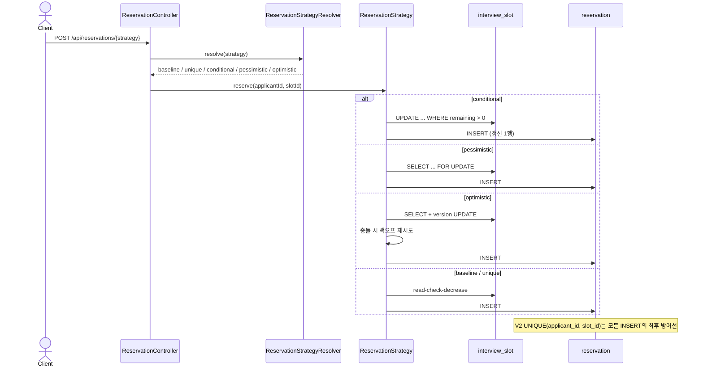

# 선착순 면접 예약 시스템 — 동시성 제어 실험

> 단순 예약 기능이 아니라, 동시성 문제를 의도적으로 재현하고 여러 방어 수단을 같은 조건에서 비교해 최종 선택의 근거를 남기는 실험형 프로젝트입니다.

학부 동아리 지원자 관리 서비스의 선착순 면접 예약 기능에서 출발했습니다. 당시에는 동시성 문제가 드러나지 않았지만, 검증되지 않았을 뿐 언제든 정원 초과와 중복 예약이 생길 수 있는 구조였습니다. 이 프로젝트는 그 문제를 다시 만들고 측정 가능한 근거로 해법을 고르는 포트폴리오입니다.

기획과 판단 기준은 [`PROJECT_PLAN.md`](PROJECT_PLAN.md), 브랜치별 진행 현황은 [`docs/STEP2-3-BRANCH-STRATEGY.md`](docs/STEP2-3-BRANCH-STRATEGY.md), 데이터 모델은 [`docs/ERD.md`](docs/ERD.md)에 있습니다.

## 다루는 문제

| 문제 | 원인 | 방어 |
|---|---|---|
| 같은 사용자의 중복 요청 | 더블클릭·네트워크 재시도 | 자연 키 `UNIQUE(applicant_id, slot_id)` |
| 다른 사용자의 마지막 자리 경쟁 | 데이터 레이스 | 조건부 UPDATE 또는 락 |

락은 정원 경쟁을 막아도 중복 요청을 해결하지 못합니다. 이 도메인에서는 `(applicant, slot)` 자체가 요청의 정체성이므로 별도 멱등성 키를 도입하지 않았습니다. 자세한 판단은 [브랜치 전략 ③](docs/STEP2-3-BRANCH-STRATEGY.md#skip-idempotency-key)를 봅니다.

## 기술 스택

| 구분 | 기술 |
|---|---|
| 언어 / 프레임워크 | Java 21, Spring Boot 3.5.16 |
| ORM / DB | Spring Data JPA, MySQL 8.0 |
| 캐시 | Redis 7 (컨테이너만 기동) |
| 부하 테스트 / 빌드 | Gatling, Gradle wrapper |

## 로컬 실행 방법

**요구사항**: JDK 21, Docker.

```bash
docker compose up -d
docker compose ps
./gradlew build
./gradlew bootRun
```

기본 접속값은 `application.yml`에 맞춰져 있습니다. 필요하면 Spring 표준 환경 변수
`SPRING_DATASOURCE_URL`, `SPRING_DATASOURCE_USERNAME`, `SPRING_DATASOURCE_PASSWORD`,
`SPRING_DATA_REDIS_HOST`, `SPRING_DATA_REDIS_PORT`로 덮어쓸 수 있습니다. 실험 환경 초기화에는
`docker compose down -v`를 사용합니다.

## 스키마

스키마는 Hibernate가 아닌 Flyway로 버전 관리합니다. 방어 수단이 들어오는 이력 자체가 실험의 증거이기 때문입니다.

| 버전 | 내용 | 단계 |
|---|---|---|
| `V1__baseline_schema_without_guards.sql` | applicant / interview_slot / reservation, 방어 제약 없음 | 1단계 |
| `V2__add_unique_reservation.sql` | `UNIQUE(applicant_id, slot_id)` | 2-1단계 ① |
| `V3__add_version_to_slot.sql` | `interview_slot.version` | 2-2단계 ⑤ |

조건부 UPDATE는 스키마 변경이 없습니다. 테이블 정의와 근거는 [`docs/ERD.md`](docs/ERD.md)에 있습니다.

## 실험 결과

**1단계 baseline, 2단계 벤치마크, 3단계 최종 선택이 완료되었습니다.** 전용 `benchmark` 프로필로 풀 100개와 로그 OFF를 고정해 서로 다른 지원자의 정원 경쟁을 방법론 v2 Williams 균형 순서로 200회 측정했고, 동일 `(지원자, 슬롯)` 요청 200건을 5개 경로에서 각 5회 검증했습니다. 측정 조건·원시 데이터·해석은 [`docs/STEP2-DEFENSE-BENCHMARK.md`](docs/STEP2-DEFENSE-BENCHMARK.md)에 있습니다.

### 1단계 — 방어 없는 baseline

락 없는 `POST /api/reservations`에 정원 100 슬롯과 서로 다른 지원자 500명을 동시에 요청했을 때 다음이 한 실행에서 나타났습니다.

- 오버부킹: 예약 113건으로 정원보다 13건 초과
- lost update: `remaining`은 40인데 예약은 113건
- 데드락: 500건 중 387건(77%)이 HTTP 500
- 409는 0건: lost update로 카운터가 0에 닿지 않아 만석을 인식하지 못함

서비스 계층에서는 간헐적이었지만 HTTP 부하가 경쟁 창을 넓히자 상시로 드러났습니다. 근거는 [서비스 계층 재현](docs/STEP1-BASELINE-OVERBOOKING.md)과 [Gatling HTTP 부하](docs/STEP1-GATLING-LOADTEST.md)에 있습니다.

### Before / After 부하 테스트

방어 5종을 두 경합 지점에서 Phase당 10회씩 측정했습니다. 한 Phase의 10개
`전략 × 경합` 처리는 매 라운드 Williams 균형 순서로 배치했습니다. Phase A는 낙관적 락 재시도 상한
5, Phase B는 상한 20인 **서로 다른 애플리케이션 기동**입니다. 따라서 각 상한은 같은 Phase의
대조 전략과 비교하고, 상한 5와 20의 차이는 앱 기동 간 민감도 분석으로만 읽습니다.

각 성능 셀은 **개별 실행값의 중앙값 (min–max)** 이며 TPS는 Gatling 전체 실행 시간이 아니라 동시
요청 버스트 구간에서 계산했습니다. OK는 시나리오가 허용한 HTTP 201/409를 함께 세므로 확정 예약
건수와 같지 않습니다. KO가 많은 행의 높은 TPS도 성공 작업 처리량이 아니므로 확정 예약, OK/KO,
정합성을 함께 봐야 합니다.

이 정원 경쟁 workload는 모든 요청에 서로 다른 지원자를 사용합니다. 원시 CSV의 `duplicates`는 관찰값일 뿐이므로 표에서 제외합니다. 동일 요청 중복 방어는 별도 25회 검증으로 판단합니다.

**Phase A — 낙관적 락 상한 5 · 낮은 경합 `capacity=100`, `contenders=120`**

| 방식 | 확정 예약 중앙값 | 오버부킹 최댓값 | KO 중앙값 | 실행별 평균 응답의 중앙값 (min–max) | 실행별 p95의 중앙값 (min–max) | 버스트 TPS의 중앙값 (min–max) | n |
|---|---:|---:|---:|---:|---:|---:|---:|
| 방어 없음 | 9 | 0 | 111 | 81.5ms (72–109) | 108.5ms (97–138) | 972.05 requests/s (784.3–1100.9) | 10 |
| ① UNIQUE | 8.5 | 0 | 111.5 | 81ms (74–102) | 116ms (94–142) | 934.55 requests/s (779.2–1111.1) | 10 |
| ② 조건부 UPDATE | 100 | 0 | 0 | 125.5ms (119–146) | 194ms (182–223) | 556.85 requests/s (466.9–594.1) | 10 |
| ④ 비관적 락 | 100 | 0 | 0 | 152ms (139–160) | 227.5ms (204–247) | 491.85 requests/s (444.4–526.3) | 10 |
| ⑤ 낙관적 락 (상한 5) | 12 | 0 | 108 | 267ms (251–276) | 318.5ms (302–340) | 347.8 requests/s (329.7–360.4) | 10 |

**Phase A — 낙관적 락 상한 5 · 극단 경합 `capacity=1`, `contenders=200`**

| 방식 | 확정 예약 중앙값 | 오버부킹 최댓값 | KO 중앙값 | 실행별 평균 응답의 중앙값 (min–max) | 실행별 p95의 중앙값 (min–max) | 버스트 TPS의 중앙값 (min–max) | n |
|---|---:|---:|---:|---:|---:|---:|---:|
| 방어 없음 | 3 | 2 | 12.5 | 77ms (66–88) | 111ms (100–121) | 1492.5 requests/s (1398.6–1652.9) | 10 |
| ① UNIQUE | 3 | 2 | 10 | 73ms (65–79) | 109ms (105–112) | 1606.65 requests/s (1418.4–1709.4) | 10 |
| ② 조건부 UPDATE | 1 | 0 | 0 | 117ms (109–164) | 180ms (162–233) | 939.05 requests/s (738–1015.2) | 10 |
| ④ 비관적 락 | 1 | 0 | 0 | 88.5ms (76–95) | 127.5ms (114–138) | 1320.15 requests/s (1156.1–1459.9) | 10 |
| ⑤ 낙관적 락 (상한 5) | 1 | 0 | 0 | 70ms (67–84) | 100ms (95–121) | 1688.05 requests/s (1398.6–1851.9) | 10 |

**Phase B — 낙관적 락 상한 20 · 낮은 경합 `capacity=100`, `contenders=120`**

| 방식 | 확정 예약 중앙값 | 오버부킹 최댓값 | KO 중앙값 | 실행별 평균 응답의 중앙값 (min–max) | 실행별 p95의 중앙값 (min–max) | 버스트 TPS의 중앙값 (min–max) | n |
|---|---:|---:|---:|---:|---:|---:|---:|
| 방어 없음 | 8 | 0 | 112 | 78ms (70–87) | 106ms (93–129) | 1025.6 requests/s (845.1–1090.9) | 10 |
| ① UNIQUE | 8.5 | 0 | 111.5 | 82ms (71–87) | 103ms (94–119) | 1004.2 requests/s (851.1–1142.9) | 10 |
| ② 조건부 UPDATE | 100 | 0 | 0 | 126ms (119–142) | 192.5ms (180–208) | 563.4 requests/s (526.3–594.1) | 10 |
| ④ 비관적 락 | 100 | 0 | 0 | 140ms (134–166) | 212.5ms (201–308) | 510.6 requests/s (369.2–531) | 10 |
| ⑤ 낙관적 락 (상한 20) | 100 | 0 | 0 | 483ms (461–531) | 774ms (711–842) | 139.5 requests/s (131.3–149.1) | 10 |

**Phase B — 낙관적 락 상한 20 · 극단 경합 `capacity=1`, `contenders=200`**

| 방식 | 확정 예약 중앙값 | 오버부킹 최댓값 | KO 중앙값 | 실행별 평균 응답의 중앙값 (min–max) | 실행별 p95의 중앙값 (min–max) | 버스트 TPS의 중앙값 (min–max) | n |
|---|---:|---:|---:|---:|---:|---:|---:|
| 방어 없음 | 3 | 2 | 13 | 75.5ms (64–89) | 105ms (94–117) | 1653.35 requests/s (1481.5–1709.4) | 10 |
| ① UNIQUE | 3 | 2 | 12 | 78ms (72–92) | 115.5ms (107–125) | 1487.2 requests/s (1398.6–1652.9) | 10 |
| ② 조건부 UPDATE | 1 | 0 | 0 | 122.5ms (109–142) | 188ms (161–209) | 913.25 requests/s (809.7–970.9) | 10 |
| ④ 비관적 락 | 1 | 0 | 0 | 97.5ms (87–137) | 140ms (125–187) | 1190.85 requests/s (877.2–1307.2) | 10 |
| ⑤ 낙관적 락 (상한 20) | 1 | 0 | 0 | 73ms (64–81) | 103.5ms (95–117) | 1639.8 requests/s (1459.9–1851.9) | 10 |

> 1단계 문서의 `contenders=500` 수치와는 **부하 조건이 다릅니다.** ⑦은 ④⑤와 조건을 맞추기 위해 위 두 지점으로 통일했습니다. 또한 Phase 사이에는 앱 기동과 실행 시점이 달라, A/B 숫자를 동일 프로세스의 짝비교로 해석하지 않습니다.

**동일 요청 검증 — `capacity=200`, 같은 `(applicantId, slotId)` 200건**

| 경로 | 실행 | 201 | 409 | 500 | DB 결과 |
|---|---:|---:|---:|---:|---|
| baseline | 5 | 5 | 0 | 995 | ✅ 예약 1건·좌석 1개 |
| ① UNIQUE | 5 | 5 | **995** | 0 | ✅ 예약 1건·좌석 1개 |
| ② 조건부 UPDATE | 5 | 5 | 0 | 995 | ✅ 예약 1건·좌석 1개 |
| ④ 비관적 락 | 5 | 5 | 0 | 995 | ✅ 예약 1건·좌석 1개 |
| ⑤ 낙관적 락 | 5 | 5 | 0 | 995 | ✅ 예약 1건·좌석 1개 |

전역 V2 UNIQUE는 모든 경로에서 중복 행과 추가 좌석 소모를 막았습니다. `/unique`만 제약 위반을 409로 번역합니다. 이는 성능 순위가 아니라 DB 안전성과 HTTP 응답 의미를 분리한 검증입니다.

### 전략별 관찰

| 전략 | 결과와 판단 | 상세 근거 |
|---|---|---|
| ① UNIQUE | 동일 요청의 DB 중복을 막지만 서로 다른 지원자의 정원 경쟁은 막지 못함 | [문서](docs/STEP2-UNIQUE-CONSTRAINT.md) |
| ② 조건부 UPDATE | 두 경합 지점에서 오버부킹·KO 0; 현재 불변식을 한 DML로 표현 | [문서](docs/STEP2-CONDITIONAL-UPDATE.md) |
| ④ 비관적 락 | 정합성은 동일하고 극단 경합에서는 더 빨랐으나, 현재 문제에는 명시적 잠금 구간이 불필요 | [문서](docs/STEP2-PESSIMISTIC-LOCK.md) |
| ⑤ 낙관적 락 | 오버부킹은 막지만 충돌·재시도 비용 때문에 상한 5는 가용성, 상한 20은 처리량을 잃음 | [문서](docs/STEP2-OPTIMISTIC-LOCK.md) |
| ③ 멱등성 키 / ⑥ 분산 락 | 현재 도메인의 자연 키·단일 DB 경계에서는 중복 도입이므로 생략 | [③](docs/STEP2-3-BRANCH-STRATEGY.md#skip-idempotency-key) · [⑥](docs/STEP2-3-BRANCH-STRATEGY.md#skip-distributed-lock) |

## 아키텍처

1단계의 락 없는 경로는 재현 자산으로 보존하고, 2단계 방어는 `ReservationStrategy` 구현체로 나란히 추가했습니다. `POST /api/reservations/{strategy}`로 같은 요청을 각 전략에 보내 방어 수단만 바꾼 비교가 가능합니다.



## 트레이드오프와 최종 선택

**최종 선택은 `UNIQUE` + 조건부 UPDATE입니다.** 두 장치는 경쟁하지 않습니다. UNIQUE는 동일 `(applicant_id, slot_id)` 중복을, 조건부 UPDATE는 마지막 자리 경쟁의 정원 불변식을 맡습니다.

조건부 UPDATE는 성능 1위라서가 아니라, **단일 슬롯 행·단순 산술 차감·`remaining > 0` 가드**를 한 문장으로 표현하는 가장 작은 메커니즘이어서 선택했습니다. v2에서 낮은 경합은 조건부 UPDATE의 평균 응답 중앙값이 작았고, 극단 경합은 비관적 락이 작았습니다. 같은 Phase의 라운드별 비교에도 직렬 위치·시점 차이가 남아 이를 락 하나의 인과 효과로 단정하지 않습니다. 따라서 비관적 락을 느리다는 이유로 배제하지 않으며, 다중 행·다단계 트랜잭션에서는 다시 후보가 됩니다. 낙관적 락은 실제 충돌이 드물고 재시도가 싼 경우에, 분산 조율은 외부 결제·다른 저장소·정확히 한 번 알림처럼 임계 구역이 DB 밖으로 확장될 때 검토합니다.

트래픽이 늘어도 공유 상태가 단일 MySQL에 남는 한 조건부 UPDATE와 UNIQUE의 원자성은 유지됩니다. 먼저 인기 슬롯 핫스폿과 DB 쓰기 한계를 측정하고, 애플리케이션 확장·읽기 분리·DB 용량을 검토합니다. 한 인기 슬롯의 마지막 자리는 어떤 방식이든 직렬화해야 하므로, 과부하는 admission control이나 대기열로 흡수합니다.

남은 API 과제는 두 가지입니다. 조건부 UPDATE의 만석 거절에서 404/409 구분 조회를 유지할지 별도 A/B로 확인하고, 중복 재시도에는 UNIQUE 위에서 기존 예약을 조회해 `200 + 기존 예약`을 반환하는 응답 계약을 설계합니다. 둘 다 별도 멱등성 키가 필요한 정합성 결함은 아닙니다.
