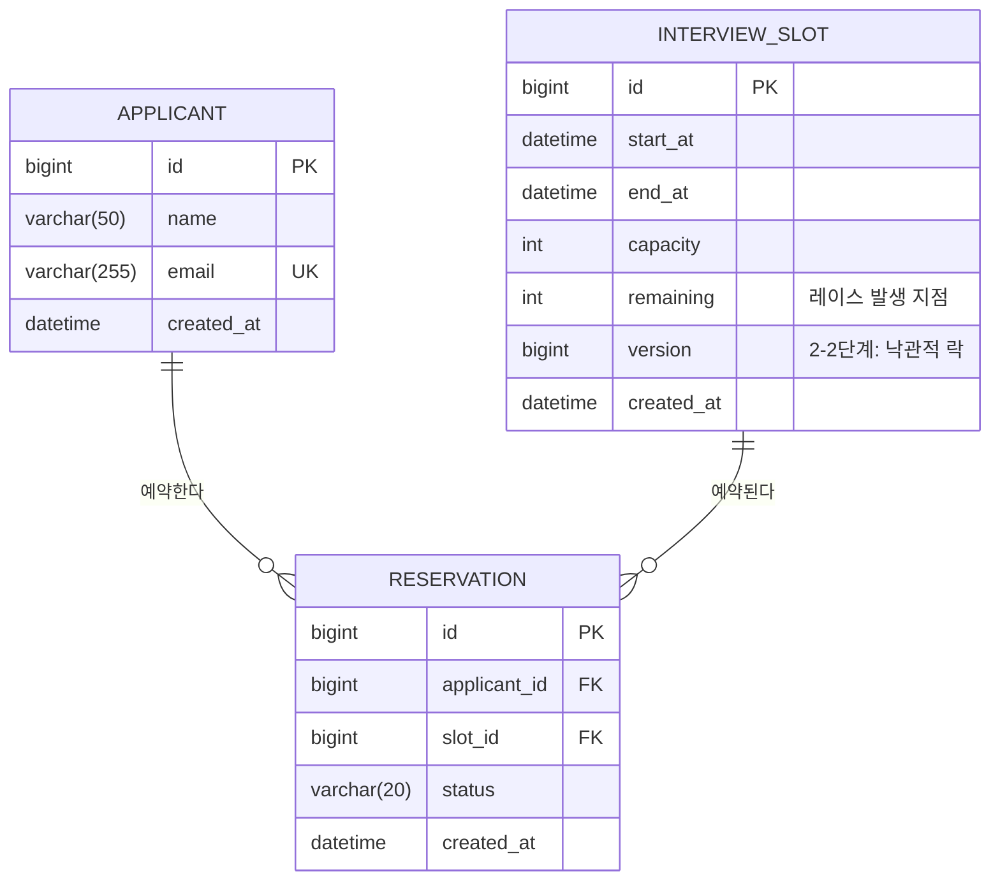

# ERD — 선착순 면접 예약 시스템

> 이 프로젝트의 스키마는 **한 번에 완성되지 않는다.** 1단계는 의도적으로 방어 장치가 없는 상태로 출발해
> 동시성 버그를 재현하고, 방어 수단은 [PROJECT_PLAN의 방어 선택 원칙](../PROJECT_PLAN.md#방어-선택-원칙)에 따라 스키마에 하나씩 추가된다.
> 따라서 이 문서는 **최종 스키마**와 **각 요소가 도입되는 단계**를 함께 표기한다.

---

## 1. 전체 관계도

> **`IDEMPOTENCY_KEY` 테이블은 도입하지 않았다(2026-07-17).** 이 도메인에서는
> `(applicant_id, slot_id)` 자연 키가 요청의 정체성을 고정하고 UNIQUE가 이를 보장한다.
> 판단 근거는 [브랜치 전략 ③](STEP2-3-BRANCH-STRATEGY.md#skip-idempotency-key)다.

관계 요약

| 관계 | 카디널리티 | 설명 |
|---|---|---|
| Applicant : Reservation | 1 : N | 한 지원자는 여러 슬롯에 예약할 수 있다 |
| InterviewSlot : Reservation | 1 : N | 한 슬롯은 `capacity`명까지 예약을 받는다 |
| Applicant : InterviewSlot | N : M | `Reservation`이 교차 엔티티. 단, **같은 조합은 1건뿐**이어야 한다 (→ 2-1단계 UNIQUE) |

그 UNIQUE 조합 `(applicant_id, slot_id)`는 이 스키마의 **자연 키**이기도 하다. 같은 쌍의 두 번째 요청은
정의상 언제나 중복이므로, 이 키가 멱등성 키 역할을 겸한다 — 별도의 `idempotency_key` 테이블을
두지 않기로 한 이유다.

---

## 2. 테이블 상세

### 2.1 `applicant` — 지원자

| 컬럼 | 타입 | 제약 | 도입 |
|---|---|---|---|
| `id` | BIGINT | PK, AUTO_INCREMENT | 1단계 |
| `name` | VARCHAR(50) | NOT NULL | 1단계 |
| `email` | VARCHAR(255) | NOT NULL, UNIQUE | 1단계 |
| `created_at` | DATETIME(6) | NOT NULL | 1단계 |

`email`의 UNIQUE는 1단계부터 넣는다. 이 프로젝트가 재현하려는 레이스는 **예약 경로**에서 발생하고,
지원자 등록은 그 경로 밖이다. 방어 수단 도입 순서를 어기는 것이 아니다.

### 2.2 `interview_slot` — 면접 슬롯

| 컬럼 | 타입 | 제약 | 도입 |
|---|---|---|---|
| `id` | BIGINT | PK, AUTO_INCREMENT | 1단계 |
| `start_at` | DATETIME(6) | NOT NULL | 1단계 |
| `end_at` | DATETIME(6) | NOT NULL | 1단계 |
| `capacity` | INT | NOT NULL | 1단계 |
| `remaining` | INT | NOT NULL | 1단계 |
| `version` | BIGINT | NOT NULL DEFAULT 0 | **2-2단계** (`@Version`) |
| `created_at` | DATETIME(6) | NOT NULL | 1단계 |

**`remaining`이 이 프로젝트 전체의 진앙지다.** 1단계 구현은 이 값을 읽고(`SELECT`),
애플리케이션 메모리에서 검사하고(`if (remaining > 0)`), 다시 쓴다(`UPDATE ... SET remaining = ?`).
읽기와 쓰기 사이에 다른 트랜잭션이 끼어들 수 있는 **check-then-act** 구조이며,
정원 초과(오버부킹)는 여기서 발생한다.

`capacity`를 따로 두는 이유: 부하 테스트 후 `capacity`와 실제 `reservation` 행 수를 비교해야
**정원이 몇 명 초과됐는지 정량적으로 증명**할 수 있다. `remaining`만으로는 음수 여부밖에 모른다.

> `remaining`을 두지 않고 매번 `COUNT(*)`로 세는 설계도 가능하다. 그러나 그 역시 check-then-act이며
> (세는 시점과 INSERT 시점 사이에 레이스), 카운터 컬럼 쪽이 2-1단계의 조건부 UPDATE
> (`SET remaining = remaining - 1 WHERE remaining > 0`)로 자연스럽게 이어진다.

### 2.3 `reservation` — 예약

| 컬럼 | 타입 | 제약 | 도입 |
|---|---|---|---|
| `id` | BIGINT | PK, AUTO_INCREMENT | 1단계 |
| `applicant_id` | BIGINT | NOT NULL, FK → `applicant.id` | 1단계 |
| `slot_id` | BIGINT | NOT NULL, FK → `interview_slot.id` | 1단계 |
| `status` | VARCHAR(20) | NOT NULL (`CONFIRMED` / `CANCELED`) | 1단계 |
| `created_at` | DATETIME(6) | NOT NULL | 1단계 |

| 인덱스 / 제약 | 도입 |
|---|---|
| `INDEX idx_reservation_slot (slot_id)` | 1단계 (검증 쿼리용) |
| `UNIQUE KEY uk_reservation_applicant_slot (applicant_id, slot_id)` | **2-1단계** |

1단계에는 UNIQUE가 **없다.** 같은 지원자가 같은 슬롯에 두 행을 만드는 중복 예약을 재현해야 하기 때문이다.
FK는 유지한다 — FK는 참조 무결성 제약이지 동시성 방어 수단이 아니고, 없으면 오히려 실험 데이터가 오염된다.

### 2.4 멱등성 키 — **미채택**

별도 `idempotency_key` 테이블·Redis 설계는 구현하지 않았다. 예약에서는 `(applicant_id, slot_id)`가
자연 키이므로 같은 요청의 중복 판정을 `UNIQUE`로 이미 수행한다. 응답 유실 뒤 재시도에 기존 결과를
반환하는 문제는 남지만, 이는 별도 키가 아니라 API 응답 계약의 문제다. 전체 판단은
[브랜치 전략 ③](STEP2-3-BRANCH-STRATEGY.md#skip-idempotency-key)를 따른다.

[`V1` 마이그레이션](../src/main/resources/db/migration/V1__baseline_schema_without_guards.sql) 상단의
“2-1단계에서 추가” 주석은 이 결정을 내리기 전의 계획 기록이다. 이미 적용된 Flyway 파일은 체크섬과
실험 이력을 보존하기 위해 수정하지 않으며, 현재 결정은 이 절과 브랜치 전략을 따른다.

---

## 3. 단계별 스키마 변화

| 단계 | 스키마 변경 | 막는 문제 |
|---|---|---|
| **1** | 위 3개 테이블, 방어 제약 없음 | — (버그 재현이 목적) |
| **2-1** | `UNIQUE(applicant_id, slot_id)` 추가 (`V2`) | 중복 예약 |
| **2-1** | (스키마 변경 없음 — 조건부 UPDATE는 쿼리 변경) | 정원 초과 |
| ~~2-1~~ | ~~`idempotency_key` 테이블 신설~~ — **미채택** | 같은 사용자의 중복 요청 → 위 UNIQUE 자연 키가 대신한다 |
| **2-2** | `interview_slot.version` 추가 (`V3`) | (낙관적 락 실험용) |

비관적 락(`SELECT ... FOR UPDATE`)은 **스키마를 바꾸지 않는다** — 쿼리 힌트일 뿐이기 때문이다.
분산 락(Redisson)도 마찬가지지만(DB 바깥이므로), 그쪽은 애초에 **구현하지 않기로 판단했다** —
분산 락은 동시성 제어가 DB 하나로 끝나지 않을 때 쓰는 도구인데 이 도메인의 임계 구역은 단일 행
UPDATE 하나다([근거](STEP2-3-BRANCH-STRATEGY.md#skip-distributed-lock)).
"락은 스키마에 흔적을 남기지 않으므로 DB가 최후 방어선이 되어주지 못한다"는 논증은
그대로 유효하다(`V3`의 `version`은 예외적으로 흔적을 남긴 경우다).

---

## 4. 후속 범위와 제약

**`UNIQUE(applicant_id, slot_id)`와 예약 취소가 충돌한다.**
취소 후 재예약을 허용하면, `CANCELED` 행이 남은 상태에서 UNIQUE가 새 `CONFIRMED` 행을 막는다.
선택지는 (a) 취소 시 행을 삭제, (b) UNIQUE에 `canceled_at`을 포함(MySQL은 NULL 중복을 허용하므로
활성 예약만 유일해진다), (c) MVP에서 취소를 제외. **1·2단계는 (c)로 단순화한다** — 취소는 이 프로젝트가
증명하려는 논지와 무관하고, 스코프만 키운다.

**`reservation`이 아니라 `interview_slot`에 카운터를 두면 슬롯 행이 핫스팟이 된다.**
같은 슬롯에 몰린 모든 요청이 한 행을 두고 경쟁한다. 현재 벤치마크는 이 핫스팟에서 전략별 처리량과
가용성을 비교한 결과를 [방어 전략 벤치마크](STEP2-DEFENSE-BENCHMARK.md)에 보존한다.
