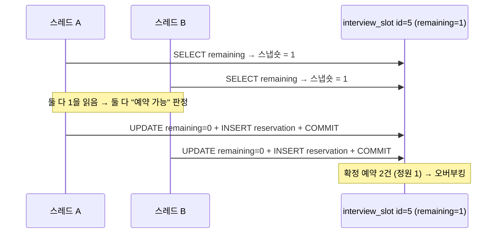
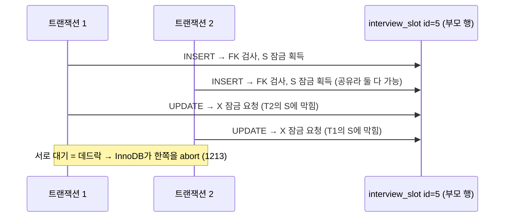

# 1단계 baseline — 오버부킹 재현 실험

> 이 문서는 **방어 장치가 없는 1단계 코드**가 동시성 버그를 실제로 일으킨다는 것을 통합 테스트로
> 재현한 기록이다. 핵심은 "터진다"가 아니라 **"간헐적으로 터진다"** 이며, 그 과정에서 함께 드러난
> **데드락**이라는 두 번째 실패 모드까지 관찰한다. 스키마 배경은 [ERD.md](ERD.md), 전체 계획은
> `PROJECT_PLAN.md` 4장(1단계)을 정본으로 한다.

관련 코드: [`BaselineOverbookingProbeTest`](../src/test/java/com/interview/reservation/concurrency/BaselineOverbookingProbeTest.java) ·
[`ReservationService.reserve()`](../src/main/java/com/interview/reservation/service/ReservationService.java) ·
[`AbstractIntegrationTest`](../src/test/java/com/interview/reservation/support/AbstractIntegrationTest.java)

---

## 1. 한 줄 요약

정원 1짜리 슬롯에 서로 다른 지원자 여러 명이 동시에 예약을 시도하면, 락 없는 baseline `reserve()`는
**정원을 넘겨 예약을 확정한다(오버부킹).** 단, 실제 MySQL에서는 이 버그가 **매번 터지지 않고
간헐적으로만** 터진다 — 바로 이 간헐성이 baseline의 진짜 위험이다.

| 항목 | 값 |
|---|---|
| 재현 계층 | 서비스 계층 (`ReservationService.reserve()`) 직접 호출 |
| 재현 도구 | JUnit 통합 테스트 + Testcontainers MySQL 8 (InnoDB, REPEATABLE READ) |
| 인터리빙 강제 | **없음** — 실제 동시 호출을 관찰만 한다 |
| 관찰된 실패 모드 | ① 오버부킹(lost update) ② 데드락(FK 잠금 충돌) |

---

## 2. 실험 설계

`reserve()`를 **그대로** 호출한다. 흐름을 조작하거나 복제하지 않는다. 정원 1짜리 슬롯 하나에 스레드
여러 개를 `CountDownLatch`로 동시에 출발시키고, 라운드를 반복해 몇 번이나 정원을 넘겼는지 집계한다.

| 파라미터 | 값 | 이유 |
|---|---|---|
| `CAPACITY` | 1 | 마지막 한 자리 경쟁이 레이스를 가장 선명하게 드러낸다 |
| `CONTENDERS` | 15 | **간헐 구간.** 너무 세면(100+) 매번 터지고, 너무 약하면 경쟁이 저절로 직렬화돼 거의 안 터진다 |
| `ROUNDS` | 10 | 간헐성을 보려면 반복이 필요하다 |
| Hikari pool | 20 | 경쟁자 전원이 동시에 DB에 닿을 수 있도록 |

- **매 라운드 새 슬롯**을 만든다 → 라운드 간 오염이 없다.
- **서로 다른 지원자**가 경쟁한다 → 여기서 보는 것은 중복 요청(멱등성 문제)이 아니라 **순수한 정원 경쟁**이다.
- 컨테이너는 [`AbstractIntegrationTest`](../src/test/java/com/interview/reservation/support/AbstractIntegrationTest.java)의 싱글턴을 공유한다.

### 단언과 로그를 분리한다

간헐적 현상은 pass/fail 게이트로 삼으면 flaky하다. 그래서 **단언은 매 실행 신뢰할 수 있는 불변식에만**
걸고, 오버부킹 발생 여부는 **로그로 증거**를 남긴다.

- 단언(항상 참): `확정 예약 수 >= 정원`(최소 1건은 성공), `성공 카운트 == 확정 행 수`
- 로그(실행마다 다름): 라운드별 확정 예약 수, 오버부킹 라운드 집계

---

## 3. 관찰 결과

같은 테스트를 여러 번 돌린 예시(수치는 실행마다 다르다):

```
=== baseline 실측: 강제 없이 실제 reserve() 동시 호출 ===
  round  1: confirmed=1
  round  2: confirmed=1
  round  3: confirmed=1
  round  4: confirmed=1
  round  5: confirmed=2   <-- 오버부킹
  round  6: confirmed=1
  round  7: confirmed=2   <-- 오버부킹
  round  8: confirmed=1
  round  9: confirmed=2   <-- 오버부킹
  round 10: confirmed=1
capacity=1, contenders=15 → 오버부킹 3/10 라운드
```

경쟁 강도를 바꿔 가며 본 오버부킹 빈도:

| 동시 경쟁자 | 오버부킹 빈도(관찰 예) | 해석 |
|---|---|---|
| 15 | 3 ~ 8 / 10 라운드 | **간헐** — baseline의 위험 구간. 같은 코드가 어떤 라운드는 터지고 어떤 라운드는 멀쩡하다 |
| 100 | 10 / 10 라운드 (건당 2~3 초과) | 거의 항상 터지지만, 초과 규모는 작다(→ 4절 데드락과 연결) |

> **왜 이게 위험한가.** "방어가 없는데도 항상 터지지는 않는다"는 것은, 개발 중 몇 번 눌러보고 부하 테스트를
> 한두 번 돌려서는 **버그를 못 잡는다**는 뜻이다. 운이 좋으면 통과하고, 운영에서 어느 순간 터진다.
> (이 프로젝트 origin story의 "그때는 몰랐던 문제"가 정확히 이 상태였다.)

---

## 4. 왜 '간헐적'인가 — 트랜잭션이 경쟁 창보다 빠르다

InnoDB REPEATABLE READ에서 일반 SELECT의 스냅숏은 **트랜잭션의 첫 읽기 순간**에 고정된다(BEGIN이
아니다). 오버부킹은 아래 "창" 안에서만 터진다:

```
스레드가 remaining=1을 읽음  ······[이 창]······  누군가 remaining=0을 커밋
```

로컬 MySQL은 `read → UPDATE → INSERT → COMMIT` 한 트랜잭션이 1ms 미만으로 끝난다. 그래서 스레드를
동시에 풀어도, 앞 스레드가 **커밋을 끝낸 뒤에야** 뒤 스레드의 첫 SELECT가 닿는 일이 잦다. 그러면 뒤
스레드는 이미 갱신된 `remaining=0`을 읽고 정상적으로 거절된다 — 락이 없는데도 **타이밍상 줄을 선** 셈이다.

경쟁 창(<1ms)에 두 스레드의 읽기가 우연히 겹칠 때만 오버부킹이 난다. 그래서 **간헐적**이다.

### 오버부킹이 일어나는 순간의 인터리빙



> 실무에서 이 창이 넓어지는 경우(느린 쿼리, 트랜잭션 안의 외부 API 호출, 네트워크 지연)가 바로 오버부킹이
> 상시로 터지는 지점이다. HTTP 부하(Gatling)로 옮기면 창이 넓어져 더 잘 재현된다 — 6절 참고.

---

## 5. 두 번째 실패 모드 — 데드락 (SQL 1213 / SQLState 40001)

부하 중 로그에 `Deadlock found when trying to get lock`(오류 1213)이 대량으로 찍힌다. 원인은
`reservation → interview_slot`의 **외래 키(FK)** 다.

한 트랜잭션이 커밋될 때 같은 슬롯 행에 잠금을 **두 종류** 건다. Hibernate는 flush 시 **INSERT를
UPDATE보다 먼저** 실행하므로 순서는 이렇다:

1. `INSERT INTO reservation (..., slot_id=5)` → FK 무결성 검사가 부모 행 `interview_slot#5`에 **공유 잠금(S)** 획득
2. `UPDATE interview_slot SET remaining=? WHERE id=5` → 같은 행에 **배타 잠금(X)** 필요 (S→X 승격)

두 트랜잭션이 같은 슬롯을 노리면 서로의 S 잠금 때문에 X 승격이 막힌다:



정원 1짜리 **단일 행**에 경쟁이 몰리므로 이 S/X 충돌이 대량 발생한다.

### 여기서 나온 통찰 두 가지

- **"실패"에는 두 종류가 섞여 있다.** `SlotFullException`(정원 0을 읽은 정상 거절)과
  `CannotAcquireLockException`(데드락 희생)은 **다른 실패 모드**다. 프로브는 확정 예약 **행 수**로
  오버부킹을 측정하므로 결론은 유효하지만, 실패 카운트를 그냥 합산해 해석하면 안 된다.
- **데드락이 우연히 부분 방어처럼 작동한다.** 100명이 경쟁해도 대부분 데드락으로 죽어서, 초과가 15가
  아니라 겨우 2~3에 그친다. 이것은 설계된 방어가 아니라 **부작용**이지만, "왜 초과 규모가 작은가"의
  답이자 2단계에서 제대로 된 방어가 필요한 이유가 된다.

---

## 6. 이 실험이 하지 않는 것 (설계 판단)

**인터리빙을 강제하지 않는다.** `CyclicBarrier` 등으로 "모든 스레드가 읽은 뒤 동시에 쓰게" 만들면
오버부킹을 100% 결정적으로 재현할 수 있다. 그러나 그 방식은 두 가지 이유로 1단계 증거로는 약하다.

1. 배리어를 트랜잭션 안에 넣어야 해서 **실제 `reserve()`가 아니라 그 복제본**을 테스트하게 된다.
2. "터질 순서를 내가 만들어 넣었다"는 것은 *버그가 존재함*이 아니라 *최악을 강제하면 터짐*의 증거다.

그래서 **1단계(버그 존재 증명)는 강제 없는 간헐 재현**으로 남기고, **최악 인터리빙 강제**는 성격을
뒤집어 **2단계(방어가 최악에도 버티는지)의 결정적 회귀 테스트**로 재활용한다. "운 좋은 순서에선 통과"가
의미 없는 방어 검증에서는 최악 강제가 오히려 미덕이 된다.

---

## 7. 한계와 다음 단계

- **계층 한정.** 이 실험은 서비스 계층 + JUnit이다. 실제 HTTP 엔드포인트의 처리량(TPS)·응답시간·실패율은
  → **Gatling 부하 테스트**로 보강했다: [STEP1-GATLING-LOADTEST.md](STEP1-GATLING-LOADTEST.md). 예고대로
  HTTP 지연이 경쟁 창을 넓혀, 간헐적이던 오버부킹이 lost update·데드락 폭증과 함께 상시로 드러났다.
- **수치는 하드웨어·타이밍 의존적.** 절대치가 아니라 "간헐적으로 터진다"는 성질과 그 메커니즘이 요점이다.
- **다음 단계(2단계) 방어**는 `PROJECT_PLAN.md` 3장 순서(UNIQUE → 조건부 UPDATE → 락)로
  도입한다. 참고로 조건부 UPDATE(`SET remaining=remaining-1 WHERE remaining>0`)는 읽기·쓰기를 원자적
  UPDATE 한 방으로 합쳐, 4절의 경쟁 창과 5절의 S→X 승격 데드락을 **동시에** 없앤다.
