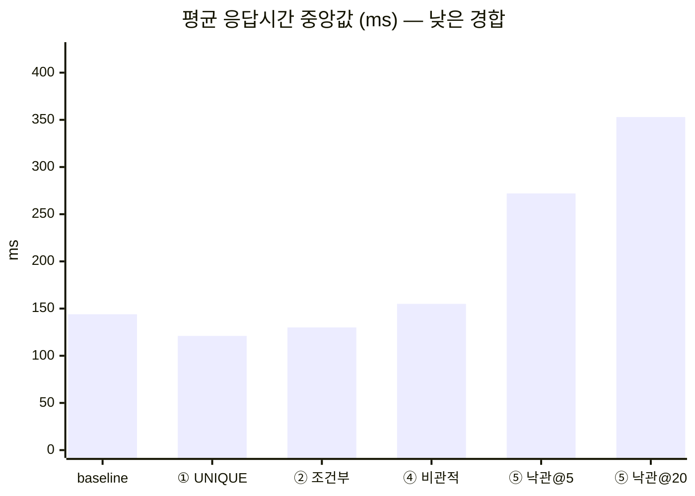
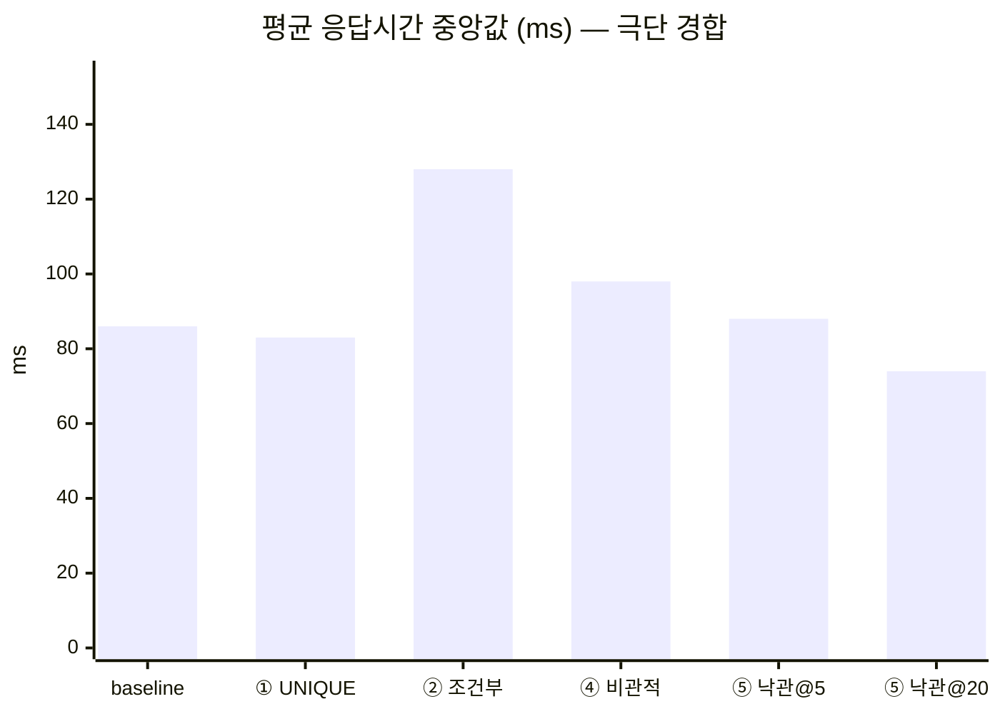

# 2단계 ⑦ 방어 전략 벤치마크 — 같은 부하, 여섯 개의 방어

> 이 문서는 baseline·①·②·④·⑤를 **같은 시나리오·같은 부하**로 두 경합 지점에서 60회 측정한
> 결과다. 각 방어의 개별 근거는 그 브랜치 문서를 정본으로 하고, 여기서는 **나란히 놓았을 때
> 무엇이 갈리는가**만 다룬다. ③(멱등성 키)과 ⑥(분산 락)은 생략하기로 판단했으므로 측정 대상이
> 아니다([근거](STEP2-3-BRANCH-STRATEGY.md#skip-idempotency-key) ·
> [근거](STEP2-3-BRANCH-STRATEGY.md#skip-distributed-lock)).

측정 자산:
[`raw-runs.csv`](benchmark/raw-runs.csv) (60행 원시 측정치) ·
[`scripts/benchmark.sh`](../scripts/benchmark.sh) ·
[`scripts/parse_gatling_report.py`](../scripts/parse_gatling_report.py) ·
[`scripts/summarize_benchmark.py`](../scripts/summarize_benchmark.py)

---

## 1. 결론 세 줄

1. **오버부킹을 실제로 막는 것은 ②④⑤ 셋뿐이다.** baseline과 ①은 극단 경합에서 정원 1짜리 슬롯에
   **3건을 확정**했다(오버부킹 2, 5회 전부). ①이 오버부킹을 막지 못한다는 것은 그동안 문서상
   주장이었는데, 여기서 처음으로 부하 실측으로 확인됐다.
2. **정합성이 동률인 셋 중에서는 ②가 이긴다.** ②④⑤ 모두 오버부킹 0·중복 0이지만, ⑤는 자리를
   채우지 못하거나(상한 5에서 120건 중 68건 503) 채우는 대신 느려지고(상한 20에서 **TPS 536→167**),
   ④는 낮은 경합에서 **5라운드 전부** ②보다 느렸다.
3. **④가 극단 경합에서 ②보다 빠른 것은 사실이지만, 그건 ④의 승리가 아니다.** 원인은 ②의
   `existsById` 추가 왕복이며 — ④가 [4-1절](STEP2-PESSIMISTIC-LOCK.md)에서 "메커니즘은 실재하지만
   이 측정으로는 확정할 수 없다"고 남긴 지점이 여기서 갈렸다 — 이는 **방어의 한계가 아니라 현재
   구현의 최적화 여지**다([6-3절](#6-3)).

## 2. 어떻게 쟀나

| 축 | 값 |
|---|---|
| 전략 | `baseline` · `unique`(①) · `conditional`(②) · `pessimistic`(④) · `optimistic`(⑤, 상한 5·20) |
| 경합 | 낮음 `cap=100 cont=120` / 극단 `cap=1 cont=200` |
| 반복 | 각 조합 5회 — **총 60회** |
| 시나리오 | 1단계와 동일. 슬롯 1개에 서로 다른 지원자 N명이 `atOnceUsers` 로 동시 예약 |
| 환경 | MySQL 8.0(REPEATABLE READ, Docker) · Spring Boot 3.5 · Gatling 3.13 · 전부 노트북 1대 |

**락마다 유리한 시나리오를 만들지 않았다.** 시나리오는 1단계 그대로 두고 `-Dstrategy`로 때리는
경로만, `-Dcapacity`/`-Dcontenders`로 경합 강도만 바꿨다
([실험 통제 원칙](STEP2-3-BRANCH-STRATEGY.md#lock-experiment-control)).

### 2-1. 실행 순서는 라운드 단위 인터리브

한 전략을 5회 연속 돌리면 JIT과 InnoDB 버퍼풀이 그 전략에만 유리하게 데워져, 나중에 도는 전략이
구조적으로 손해를 본다. 그래서 **라운드마다 전 전략을 한 바퀴씩** 돌렸다. 부수 효과가 하나 더
있는데, 이게 결과적으로 이 벤치마크에서 가장 쓸모 있었다 — **같은 라운드의 두 값은 거의 같은
머신 상태에서 나온 것**이라 실행 간 편차가 상쇄된다. ④가 범위 겹침 때문에 확정하지 못한 비교를
[6절](#conditional-vs-pessimistic)에서 가릴 수 있었던 근거다.

### 2-2. TPS는 Gatling 값을 쓰지 않았다

Gatling의 `meanNumberOfRequestsPerSecond`는 **시드 구간(지원자 120~200명 생성)까지 포함한 전체
구간**으로 나눈 평균이라, 1초 안에 끝나는 버스트의 처리율이 십수 초짜리 시드에 희석된다(확인:
10요청·2초 구간 → 5rps로 보고). 이 부하는 `atOnceUsers` 버스트라 전원이 t=0에 발사되고 마지막
요청이 최대 응답시간에 끝나므로, **`요청 수 ÷ 최대 응답시간`**이 이 구도에서 처리율의 정확한
정의다. 표의 TPS는 그렇게 계산한 값이다.

### 2-3. 정합성은 리포트가 아니라 DB에서 읽는다

오버부킹은 HTTP 응답이 아니라 **확정된 행 수**로만 증명된다(1단계부터 지켜 온 원칙). 실행마다
그 실행이 만든 슬롯을 특정해 `remaining`·확정 예약 수·(지원자, 슬롯) 중복 수를 MySQL에 직접
질의했다. 정합성 지표만은 5회의 **최댓값**을 싣는다 — 5회 중 1회라도 터지면 그 방어는 막지
못한 것이므로, 평균을 내면 실패가 희석된다.

### 2-4. 이 측정이 못 하는 것

- **Gatling·앱·MySQL이 한 노트북에서 함께 돈다.** 절대 수치는 이 환경 밖에서 의미가 없다.
  그래서 아래 표는 전부 **중앙값과 min–max 범위를 함께** 싣고, 배수로 단정하지 않는다.
- **5회는 통계적으로 넉넉하지 않다.** 범위가 겹치는 비교는 겹친다고 읽어야 하며, 그 경우에만
  짝비교표([6절](#conditional-vs-pessimistic))로 방향을 본다.
- **DB에 이전 실행 데이터가 누적된 상태에서 쟀다**(측정 시작 시점 슬롯 49개·예약 2181건).
  정합성 질의가 전부 **슬롯 단위**라 결과에는 영향이 없지만, 절대 응답시간에는 인덱스 크기가
  섞여 있다.

## 3. 결과 — 정합성 (이 벤치마크의 본론)

### 낮은 경합 `cap=100 cont=120`

| 전략 | 확정 예약 | 오버부킹 | 중복 | KO(실패) | 평균 응답 (중앙값) | p95 | TPS | n |
|---|---|---|---|---|---|---|---|---|
| baseline (방어 없음) | 27 | 0 | 0 | **93** | 144 <sub>(103–193)</sub> | 240 | 474.3 | 5 |
| ① UNIQUE | 26 | 0 | 0 | **94** | 121 <sub>(111–150)</sub> | 197 | 497.9 | 5 |
| ② 조건부 UPDATE | 100 | 0 | 0 | 0 | 130 <sub>(119–152)</sub> | 210 | 535.7 | 5 |
| ④ 비관적 락 | 100 | 0 | 0 | 0 | 155 <sub>(143–157)</sub> | 241 | 485.8 | 5 |
| ⑤ 낙관적 락 (상한 5) | 52 | 0 | 0 | **68** | 272 <sub>(238–322)</sub> | 384 | 299.3 | 5 |
| ⑤ 낙관적 락 (상한 20) | 100 | 0 | 0 | 0 | 353 <sub>(326–389)</sub> | 636 | 166.9 | 5 |

### 극단 경합 `cap=1 cont=200`

| 전략 | 확정 예약 | 오버부킹 | 중복 | KO(실패) | 평균 응답 (중앙값) | p95 | TPS | n |
|---|---|---|---|---|---|---|---|---|
| baseline (방어 없음) | 3 | **2** | 0 | **8** | 86 <sub>(67–110)</sub> | 136 | 1298.7 | 5 |
| ① UNIQUE | 3 | **2** | 0 | **7** | 83 <sub>(78–117)</sub> | 128 | 1470.6 | 5 |
| ② 조건부 UPDATE | 1 | 0 | 0 | 0 | 128 <sub>(104–150)</sub> | 211 | 877.2 | 5 |
| ④ 비관적 락 | 1 | 0 | 0 | 0 | 98 <sub>(79–112)</sub> | 152 | 1087 | 5 |
| ⑤ 낙관적 락 (상한 5) | 1 | 0 | 0 | 0 | 88 <sub>(69–99)</sub> | 140 | 1227 | 5 |
| ⑤ 낙관적 락 (상한 20) | 1 | 0 | 0 | 0 | 74 <sub>(69–77)</sub> | 123 | 1351.4 | 5 |

### 3-1. ①은 오버부킹을 막지 못한다 — 처음으로 실측됐다

극단 경합에서 baseline과 ①은 **정원 1짜리 슬롯에 3건을 확정**했다(5회 전부 동일). ①의 UNIQUE는
`(applicant_id, slot_id)` 쌍의 중복만 막는데, 이 부하는 **서로 다른 지원자**가 같은 슬롯을 두고
경쟁하는 구도라 UNIQUE가 볼 것이 아무것도 없다. [STEP2-UNIQUE-CONSTRAINT.md](STEP2-UNIQUE-CONSTRAINT.md)와
[브랜치 전략의 원칙 2](STEP2-3-BRANCH-STRATEGY.md)가 예고한 그대로이며, 그동안 서술로만 있던
주장이 여기서 **부하 실측**으로 확인됐다. ①과 ②는 대체재가 아니라 **서로 다른 문제를 막는
직교하는 방어**라는 뜻이다.

### 3-2. 낮은 경합의 "오버부킹 0"은 baseline의 성공이 아니다 ⚠️

표에서 baseline과 ①이 낮은 경합에서 오버부킹 0인 것을 **방어가 작동한 것으로 읽으면 안 된다.**
같은 칸의 KO를 함께 봐야 한다 — 120건 중 **93/94건이 실패**했고 확정 예약은 100석 중 **26~27건**뿐이다.
넘칠 만큼 도달하지 못한 것이지 막은 것이 아니다.

KO의 정체는 1단계가 이미 문서화한 **FK 락 승격 데드락**이다([STEP1-BASELINE-OVERBOOKING.md §5](STEP1-BASELINE-OVERBOOKING.md)).
Phase A 앱 로그에 `Deadlock found when trying to get lock` 이 **2817회**, `Lock wait timeout` 은
**0회** 기록됐다. 1단계가 "데드락이 우연히 부분 방어처럼 작동한다"고 적은 그 현상이 여기서
정량화된 것이다 — **가용성을 93% 내주고 산 정합성**이라 방어라고 부를 수 없다.

극단 경합에서 baseline의 KO가 8건으로 뚝 떨어지는 것도 같은 이유다. 정원이 1이라 대부분의 요청이
FK 공유 락을 잡기 전에 만석 판정으로 빠져나가, 승격 충돌에 참여하는 요청 자체가 줄어든다.
**그래서 데드락이 줄어든 극단 경합에서 오히려 오버부킹이 드러난다** — 두 실패 모드가 서로를
가리고 있었다는 뜻이고, 경합 지점을 둘 다 재지 않았다면 놓쳤을 관계다.

### 3-3. ⑤의 KO는 성격이 다르다 — 데드락이 아니라 503

⑤(상한 5)의 낮은 경합 KO 68건은 데드락이 아니라 **재시도 소진(503)**이다. 근거는 두 가지로
맞물린다 — 재시도 분포의 `retryExhausted` 가 정확히 68이고, `deadlocks` 는 전 실행에서 **0**이다.
⑤가 첫 구현에서 baseline과 똑같은 FK 데드락을 재현했다가 flush 순서를 바로잡아 없앤 이력이
있는데([STEP2-OPTIMISTIC-LOCK.md 3절](STEP2-OPTIMISTIC-LOCK.md)), 그 수정이 60회 부하에서도
유지된다는 것이 함께 확인된다.

**같은 KO라도 baseline의 500(데드락)과 ⑤의 503(소진)은 전혀 다른 실패다.** 전자는 방어가 없어
DB가 임의로 죽인 것이고, 후자는 방어가 "지금은 처리 못 한다"고 **의도적으로** 거절한 것이다.
KO 열만 보고 둘을 같은 줄에 세우면 안 된다.

## 4. 성능 — 한눈에

정합성이 동률인 ②④⑤ 사이에서 무엇이 갈리는지는 응답시간에서 드러난다. **두 지점의 막대 순서가
서로 다르다는 것**이 이 절의 요지다 — 어느 방어가 빠른지는 경합 지점에 따라 바뀐다.





낮은 경합에서 ⑤ 두 막대가 유독 높고, 극단 경합에서는 오히려 가장 낮다. 그 반전이 5절이고,
②와 ④가 두 지점에서 자리를 바꾸는 것이 6절이다. baseline·①의 막대는 **비교 대상이 아니다** —
요청의 77~78%(120건 중 93·94건)가 데드락으로 죽은 상태의 평균이라 빠른 것이 아니라 도달하지 못한 것이다(3-2절).

## 5. ⑤ 낙관적 락이 치르는 비용

### 5-1. 재시도 분포

| 상한 | 경합 | 성공 | 재시도 소진(503) | 버전 충돌 | 데드락 | 성공당 평균 시도 |
|---|---|---|---|---|---|---|
| 5 | 낮음 `cap=100` | 52 | 68 <sub>(68–69)</sub> | 437 <sub>(434–439)</sub> | 0 | 2.8 |
| 5 | 극단 `cap=1` | 1 | 0 <sub>(—)</sub> | 9 <sub>(2–9)</sub> | 0 | 1 |
| 20 | 낮음 `cap=100` | 100 | 0 <sub>(—)</sub> | 492 <sub>(484–504)</sub> | 0 | 4.6 |
| 20 | 극단 `cap=1` | 1 | 0 <sub>(—)</sub> | 9 <sub>(8–9)</sub> | 0 | 1 |

### 5-2. ⚠️ ⑤에게는 "낮은 경합/극단 경합"의 의미가 정반대다

**이 각주 없이 위 표의 ⑤ 행을 읽으면 의미가 뒤집힌 채로 읽힌다.** 다른 전략의 경합은 요청 수로
정해지지만, 낙관적 락의 경합은 **같은 행에 성공적으로 쓰는 횟수**로 정해진다
([STEP2-OPTIMISTIC-LOCK.md 5-1절](STEP2-OPTIMISTIC-LOCK.md#5-1-경합-축이-다른-전략과-반대로-뒤집힌다-이-브랜치의-핵심-발견)).

| 지점 | 다른 전략에게 | ⑤에게 | 실측 (버전 충돌) |
|---|---|---|---|
| `cap=100 cont=120` | **낮은** 경합 | **최악** — 성공적 쓰기가 100번 | **437~492회** |
| `cap=1 cont=200` | **극단** 경합 | **가장 쉬움** — 쓰기가 한 번뿐 | **9회** |

극단 경합에서 ⑤가 전 전략 중 가장 빠른 것(74ms)은 낙관적 락이 강해서가 아니라, **슬롯이 차는
순간 나머지 199건이 버전 충돌이 아니라 만석 거절을 받고 재시도 없이 빠져나가기** 때문이다.
이 지점의 ⑤ 수치는 사실상 "재시도가 거의 일어나지 않은 ⑤"의 수치다.

### 5-3. 상한 5와 20 — 고를 만한 값이 없다

⑤ 행이 두 개인 이유다. **상한을 적지 않은 ⑤ 측정치는 해석이 불가능하다.**

| 상한 | 자리를 채우는가 | 대가 |
|---|---|---|
| 5 | ❌ 100석 중 **52석**만. 120건 중 **68건이 503** | 응답 272ms / TPS 299 |
| 20 | ✅ **100석 전부**, 503 0건 | 응답 **353ms** / TPS **167** — ②의 **3분의 1** |

낮으면 가용성을, 높으면 응답시간을 내준다. 성공당 평균 시도가 2.8 → 4.6으로 늘어난다.

**상한 20의 시도 분포가 상한 5의 실패를 그대로 설명한다.** 낮은 경합에서 분포를 떠 보면
([`optimistic-attempt-distribution-cap20.json`](benchmark/optimistic-attempt-distribution-cap20.json)):

```
시도  1:13  2: 7  3:11  4:11  5: 6  6:20  7:25  8: 6  9: 1     (성공 100, 소진 0, 평균 4.86)
                              └────────── 6회 이상 필요: 52건 ──────────┘
```

성공한 100건 중 **52건이 6회 이상**을 썼다 — 즉 상한이 5였다면 이 52건은 자리를 얻지 못하고 503을
받았을 요청이다. 상한 5에서 실제로 관측된 소진이 68건이었으니, 자릿수와 방향이 맞는다. 상한은
임의의 숫자가 아니라 **"몇 번째 시도까지 살려 줄 것인가"를 고르는 손잡이**이고, 이 도메인의 분포는
그 손잡이를 어디에 둬도 무언가를 잃도록 퍼져 있다.

이 "정답 없는 튜닝"은 ⑤가 치르는 비용의 일부이며, ②·④에는 **대응하는 손잡이가 아예 없다** —
튜닝할 것이 없다는 게 단순한 도구의 이점이다.

<a id="conditional-vs-pessimistic"></a>
## 6. ②와 ④는 경로마다 방향이 다르다

### 6-1. 라운드별 짝비교 (평균 응답, ms)

인터리브로 쟀으므로 **같은 라운드의 두 값은 거의 같은 머신 상태**에서 나왔다. 
실행 간 편차가 상쇄되어 전략 간 차이만 남는다 — 중앙값 표의 범위가 겹칠 때 방향을 가리는 근거다.

| 경합 | 라운드 | ② 조건부 | ④ 비관적 | 차(②−④) | 빠른 쪽 |
|---|---|---|---|---|---|
| 낮음 | 1 | 152 | 155 | -3 | **②** |
| 낮음 | 2 | 139 | 143 | -4 | **②** |
| 낮음 | 3 | 130 | 157 | -27 | **②** |
| 낮음 | 4 | 119 | 155 | -36 | **②** |
| 낮음 | 5 | 127 | 157 | -30 | **②** |
| **낮은 경합 합계** | | | | | **② 5승 / ④ 0승** |
| 극단 | 1 | 150 | 103 | +47 | **④** |
| 극단 | 2 | 128 | 95 | +33 | **④** |
| 극단 | 3 | 104 | 112 | -8 | **②** |
| 극단 | 4 | 120 | 79 | +41 | **④** |
| 극단 | 5 | 149 | 98 | +51 | **④** |
| **극단 경합 합계** | | | | | **② 1승 / ④ 4승** |

### 6-2. ④가 남긴 숙제가 갈렸다

[STEP2-PESSIMISTIC-LOCK.md 4절](STEP2-PESSIMISTIC-LOCK.md)은 손으로 7쌍을 재고 이렇게 끝냈다 —
낮은 경합에서는 ②가 앞섰지만(6/7), 극단 경합에서는 *"두 범위가 완전히 겹쳐 어느 쪽이 빠르다고
단정하지 않는다. 다만 뒤집힐 이유는 실재한다. ⑦에서 반복 측정으로 가릴 지점이다."*

**갈렸다.** 낮은 경합은 ②가 **5/5**, 극단 경합은 ④가 **4/5**다. 방향이 경로에 따라 실제로
뒤집힌다는 것이, 같은 라운드 안에서 짝지어 비교했을 때 확인된다.

원인은 ④가 예측한 그대로다 — 요청 1건이 발생시키는 쿼리 수가 **경로마다 반대**이기 때문이다.

| 경로 | ② 조건부 | ④ 비관적 | 어느 지점이 이 경로 우세인가 |
|---|---|---|---|
| 성공(자리 있음) | **3** | 4 | 낮은 경합 — 120건 중 100건이 INSERT 까지 간다 |
| 거절(만석) | 3 | **2** | 극단 경합 — 200건 중 199건이 거절된다 |

②는 UPDATE가 0행일 때 **만석**인지 **없는 슬롯**인지 구분하려고 `existsById`를 한 번 더 던진다.
거절이 지배적인 극단 경합에서는 그 왕복이 200건 중 199건에 붙으므로, 그대로 응답시간 차이가 된다.

<a id="6-3"></a>
### 6-3. 그래도 ④의 승리가 아니다

`existsById`는 **방어 메커니즘이 아니라 예외 메시지를 정확히 만들려고 넣은 조회**다(404와 409 구분).
없애거나 지연시키면 ②의 거절 경로도 2쿼리가 되어 이 우위는 사라진다. 즉 이 격차는 *조건부
UPDATE라는 방어의 한계*가 아니라 *현재 구현의 최적화 여지*다.

이 벤치마크는 그 최적화를 **일부러 하지 않은 채** 쟀다. ②는 이미 머지된 브랜치이고, 측정 도중
측정 대상을 바꾸면 표의 각 행이 서로 다른 실험이 되기 때문이다. 최적화와 그 효과 확인은 ⑧으로
넘긴다.

**결론이 흔들리지 않는 이유는 따로 있다.** ④의 채택 여부는 성능 차의 방향에 달려 있지 않다 —
정합성이 **동률**인 이상, 성능이 동률이기만 해도 락은 이미 진다. 락 대기, 트랜잭션 길이만큼의
락 보유, 다중 자원일 때의 데드락 위험이라는 **구조적 비용을 대가 없이** 치르기 때문이다.
**동률이면 더 단순한 쪽이 이긴다.**

## 7. 그래서 무엇이 남는가

| | 오버부킹 | 중복 | 자리를 다 채우는가 | 튜닝 손잡이 | 스키마 변경 | 평가 |
|---|---|---|---|---|---|---|
| baseline | ❌ **발생** | ❌ | ❌ (데드락 93%) | — | — | 재현 자산 |
| ① UNIQUE | ❌ **발생** | ✅ | ❌ | 없음 | `V2` | **직교 방어** — 중복 전용, 계속 유지 |
| ② 조건부 UPDATE | ✅ 0 | ①에 위임 | ✅ | 없음 | 없음 | **채택** |
| ④ 비관적 락 | ✅ 0 | ①에 위임 | ✅ | 없음 | 없음 | 미채택 — 동률 + 구조적 비용 |
| ⑤ 낙관적 락 | ✅ 0 | ①에 위임 | 상한에 따라 | **상한·백오프** | `V3` | 미채택 — 이 경합 축에서 최악 |

**①과 ②는 함께 간다.** 벤치마크가 가장 선명하게 보여준 것은 둘이 경쟁 관계가 아니라는 점이다 —
①은 오버부킹을 못 막고(3-1), ②는 중복을 안 막는다. 최종 구성은 **① UNIQUE(중복) + ② 조건부
UPDATE(오버부킹)**이며, 락 2종은 그 선택의 대조군으로 남는다.

**가장 단순한 도구가 이겼다.** ②는 스키마 변경도, 튜닝 손잡이도, 추가 인프라도 없이 정합성 최고
등급을 달성했고 낮은 경합에서 가장 빨랐다. 무거운 도구를 꺼낼 이유가 이 도메인에는 없었다는 것이
60회 측정의 결론이며, ③·⑥을 생략한 판단과 같은 방향이다.

## 8. 다음

**⑧ `step3/tradeoff-analysis`** — 이 수치를 근거로 각 방식의 적합 상황과 최종 선택을 README에
문서화한다. 함께 넘기는 항목 둘:

- **②의 `existsById` 최적화**(6-3절). 거절 경로를 3쿼리 → 2쿼리로 줄이고 A/B로 재면, 극단 경합의
  ④ 우위가 사라지는지 확인할 수 있다.
- **③이 남긴 API 응답 설계 문제**([근거](STEP2-3-BRANCH-STRATEGY.md#skip-idempotency-key)). 응답을
  못 받고 재시도한 클라이언트가 409를 받는 문제 — `DataIntegrityViolationException` 을 잡은 자리에서
  기존 예약을 조회해 200으로 돌려주면 끝나는 몇 줄짜리 개선이다.

## 9. 재현

```bash
docker compose up -d
./gradlew bootRun                                    # Phase A (⑤ 상한 5)
scripts/benchmark.sh --phase a --rounds 5            # 50회

# ⑤ 상한은 @Value 로 기동 시점에 고정되므로 앱을 다시 띄운다
./gradlew bootRun --args='--reservation.optimistic.max-attempts=20'
scripts/benchmark.sh --phase b --rounds 5            # 10회

python3 scripts/summarize_benchmark.py docs/benchmark/raw-runs.csv
```

측정치는 `docs/benchmark/raw-runs.csv` 에 append 된다. 표의 모든 숫자는 그 60행에서 계산되므로,
이 문서의 어떤 수치든 원시 실행 단위까지 되짚을 수 있다 — ④가 *"경향의 기록이지 재현 가능한
측정 자산이 아니다"* 라고 스스로 달았던 단서를 갚는 것이 이 CSV의 목적이다.
