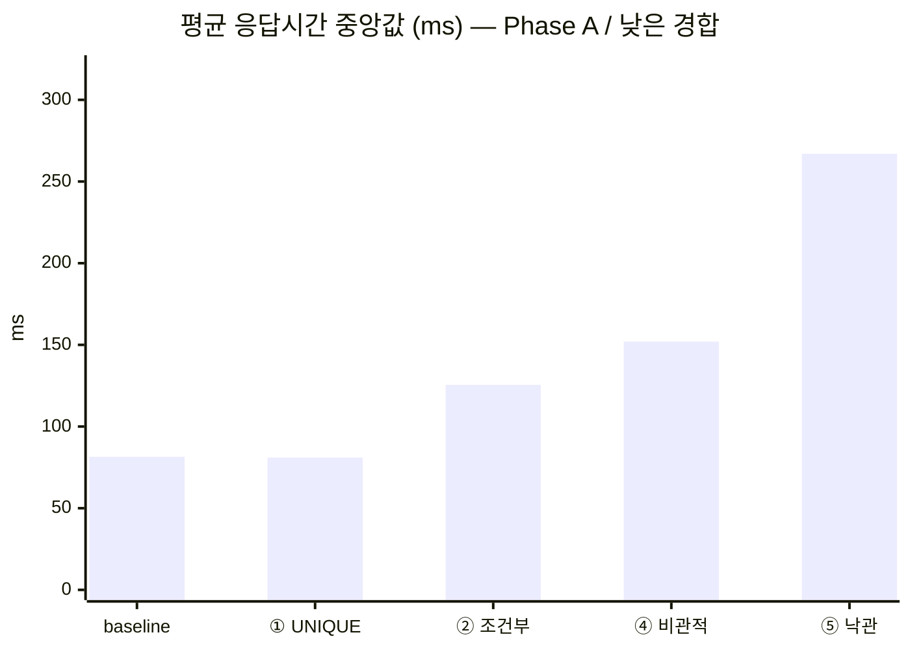
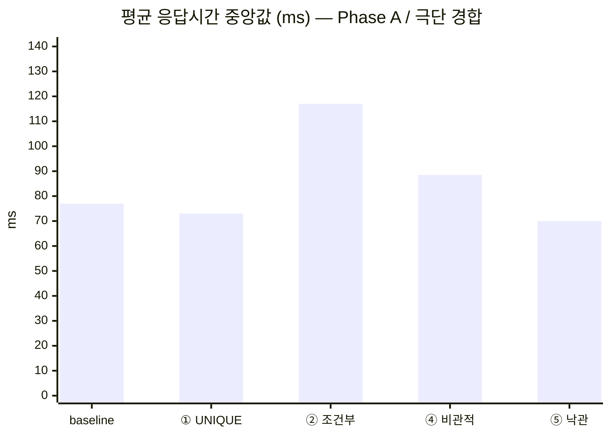
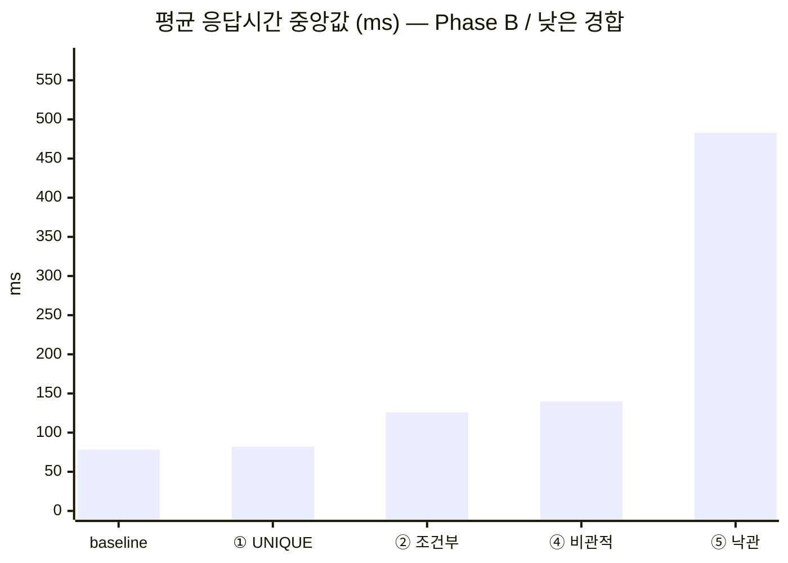
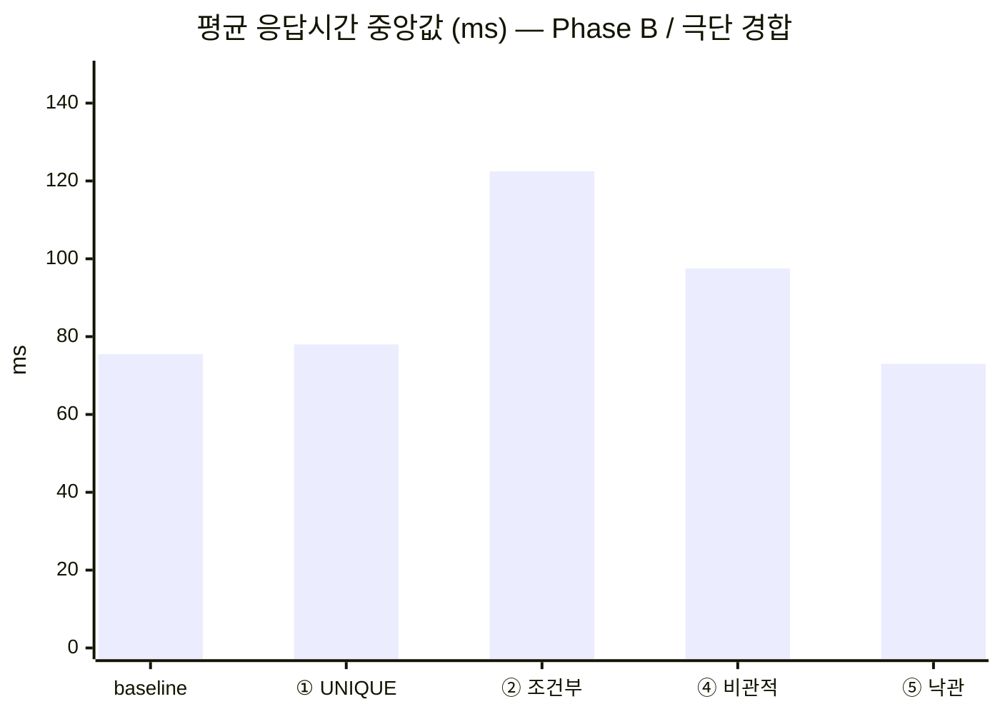

# 2단계 ⑦ 방어 전략 벤치마크 — 균형 순서와 두 Phase

> 현재 결론의 근거는 방법론 v2 성공 캠페인 `2026-09-25-williams-v2-01`이다. 검증을 통과한
> 200개 측정 행을 Phase A/B 안에서만 비교한다. 2026-09-24의 60행은
> `methodology-v1-fixed-order` 역사 자료이고, 2026-09-04 결과는 설정 비용이 섞인 초기 자료다.

현재 측정 자산:

- [v2 정본 `raw-runs-v2.csv`](benchmark/raw-runs-v2.csv)
- [성공 캠페인 원시 데이터](benchmark/campaigns/2026-09-25-williams-v2-01/raw-runs.csv)
- [캠페인 매니페스트](benchmark/campaigns/2026-09-25-williams-v2-01/manifest.md)
- [Phase A 환경 스냅샷](benchmark/campaigns/2026-09-25-williams-v2-01/environment-phase-a.json)
- [Phase B 환경 스냅샷](benchmark/campaigns/2026-09-25-williams-v2-01/environment-phase-b.json)
- [`scripts/benchmark.sh`](../scripts/benchmark.sh) ·
  [`scripts/validate_benchmark_campaign.py`](../scripts/validate_benchmark_campaign.py) ·
  [`scripts/summarize_benchmark.py`](../scripts/summarize_benchmark.py)

③(멱등성 키)과 ⑥(분산 락)은 도메인 전제가 맞지 않아 생략했으므로 측정 대상이 아니다
([③ 근거](STEP2-3-BRANCH-STRATEGY.md#skip-idempotency-key) ·
[⑥ 근거](STEP2-3-BRANCH-STRATEGY.md#skip-distributed-lock)).

---

## 1. 결론 세 줄

1. **오버부킹을 막은 것은 ②·④·⑤다.** 두 Phase의 극단 경합에서 baseline과 ①은 오버부킹
   최댓값이 2였고, ②·④·⑤는 0이었다. ①의 UNIQUE는 중복 요청과 정원 경쟁이 서로 다른
   문제임을 보여준다.
2. **낙관적 락 상한은 가용성과 비용 사이의 민감한 손잡이다.** Phase A의 상한 5는 낮은
   경합에서 확정 예약 중앙값 12, KO 중앙값 108이었고, Phase B의 상한 20은 100석을 채웠지만
   평균 응답 중앙값 483ms였다. 두 값은 서로 다른 앱 기동에서 얻었으므로 직접 짝비교하지 않는다.
3. **②의 채택 근거는 보편적인 속도 우위가 아니다.** 낮은 경합에서는 ②가 ④보다 빨랐고 극단
   경합에서는 대체로 ④가 빨랐다. 현재 불변식 `remaining > 0`과 감소를 한 행의 조건부 상태
   전이로 가장 작게 표현한다는 이유로 ① UNIQUE + ② 조건부 UPDATE를 선택한다.

## 2. 어떻게 쟀나

| 축 | 값 |
|---|---|
| 캠페인 | `2026-09-25-williams-v2-01`, schema v2, `williams-10-v1` |
| 원자적 처리 | 5개 전략 × 2개 경합 = 10개 treatment |
| 전략 | `baseline` · `unique`(①) · `conditional`(②) · `pessimistic`(④) · `optimistic`(⑤) |
| 경합 | 낮음 `cap=100 cont=120` / 극단 `cap=1 cont=200` |
| Phase | A: 새 앱 기동·낙관적 상한 5 / B: 다시 새 앱 기동·낙관적 상한 20 |
| 측정 반복 | treatment당 Phase별 10회, Phase당 100행, 총 200행 |
| warmup | 각 Phase에서 schedule 첫 행의 10개 treatment를 모두 1회 실행한 뒤 측정; 원시 측정 행에는 미포함 |
| 시나리오 | 슬롯 1개에 서로 다른 지원자 N명이 `atOnceUsers`로 동시 예약 |
| 실행 위치 | Gatling·앱·MySQL이 노트북 1대에서 함께 실행 |

락마다 유리한 별도 시나리오를 만들지 않았다. 1단계와 같은 예약 부하에서 전략·정원·경쟁자 수만
treatment로 바꿨다
([실험 통제 원칙](STEP2-3-BRANCH-STRATEGY.md#lock-experiment-control)).

### 2-1. Williams 순서가 균형을 잡는 정확한 범위

각 Phase의 10라운드는 매 라운드 10개 treatment를 한 번씩 실행한다. 완전한 10라운드 주기 안에서
각 treatment는 직렬 위치 1~10에 정확히 한 번씩 놓이고, 서로 다른 treatment의 각 유향 순서쌍은
라운드 내부의 바로 앞/뒤 조합으로 정확히 한 번 나타난다. 이 범위에서 고정 순서가 특정 전략에
계속 유리해지는 문제를 상쇄한다.

다만 실행은 여전히 한 노트북에서 직렬이다. 균형 순서는 두 전략을 동시에 실행하거나 같은 직렬
위치에 놓지 않으며, 시간 경과·캐시·DB 상태 변화까지 제거하지 않는다. 따라서 ②/④ 비교는 같은
캠페인·Phase·측정 라운드·경합으로만 연결하고 두 전략의 실제 위치를 함께 공개한다.

### 2-2. 두 앱 기동과 환경 증거

Phase A와 B는 각각 새 JVM을 시작했다. 각 Phase의 실행 전 환경 API로 다음을 검증하고, 응답
JSON의 SHA-256을 모든 원시 행과 매니페스트에 기록했다.

- `benchmark` 프로필, Hikari minimum/maximum 100과 준비된 연결 100개
- Hibernate SQL·bind·root 로그 OFF
- exponential jitter backoff, base 10ms, max 200ms
- Phase A의 실제 낙관적 상한 5, Phase B의 실제 상한 20

| Phase | `app_start_id` | 상한 | 환경 증거 | SHA-256 |
|---|---|---:|---|---|
| A | `2026-09-25-williams-v2-01-phase-a` | 5 | [Phase A JSON](benchmark/campaigns/2026-09-25-williams-v2-01/environment-phase-a.json) | `4472ebb50581d14bf201f2ba73c5b520dcbf5a171169a1e2a2c6ec8d92f2c863` |
| B | `2026-09-25-williams-v2-01-phase-b` | 20 | [Phase B JSON](benchmark/campaigns/2026-09-25-williams-v2-01/environment-phase-b.json) | `98150f591c03da90cd76ed7660c4820109bfb1ef38f874a68f1fd6db5cebad76` |

환경 해시는 모든 해당 Phase 원시 행과 [매니페스트](benchmark/campaigns/2026-09-25-williams-v2-01/manifest.md)에
연결된다.
상한 비교는 이처럼 앱 기동 사이의 민감도 분석이며 같은 프로세스의 짝비교가 아니다. 반면 각 상한과
baseline·①·②·④의 비교는 같은 Phase와 앱 기동 안에서 이뤄진다.

### 2-3. 실제 요청 구간의 burst TPS와 정합성

Gatling 기본 RPS는 지원자 시드 시간까지 포함하므로 이 짧은 버스트에는 맞지 않는다. v2의 burst
TPS는 각 실행에서 기록한 실제 예약 요청 시작·종료 timestamp로
`requests × 1000 ÷ (burst_end_epoch_ms - burst_start_epoch_ms)`를 계산한다. 절대 시스템 용량이나
성공 처리량이 아니라, 같은 실행 환경 안에서 요청 버스트가 끝난 속도다.

확정 예약·남은 정원·오버부킹·중복은 실행 후 MySQL에서 직접 읽는다. 표에서 확정 예약과 KO는
10개 실행값의 중앙값, 오버부킹과 중복은 한 번이라도 발생한 실패를 숨기지 않도록 최댓값이다.
성능 셀은 다음처럼 모두 **실행별 값**을 먼저 구한 뒤 그 10개의 중앙값과 min–max 범위를 표시한다.

- `실행별 평균 응답의 중앙값 (min–max) (ms)`
- `실행별 p95의 중앙값 (min–max) (ms)`
- `버스트 TPS의 중앙값 (min–max) (requests/s)`

mean·p95·TPS에는 OK와 KO가 함께 들어간다. 특히 baseline·①·상한 5의 높은 KO를 포함한 TPS를
successful-work throughput으로 읽으면 안 된다. `n=10`은 요청 수가 아니라 해당 셀의 독립 실행
수다.

### 2-4. 공개 검증 경계

다음 명령이 캠페인 ID·두 Phase·행 수·성공 상태·Williams 순서·환경 해시·상한·고유 슬롯·TPS
재계산 가능성을 검증한다. incomplete·failed·혼합·불균형 캠페인은 complete로 통과하지 못하며,
완전한 캠페인만 v2 정본으로 승격할 수 있다.

```bash
python3 scripts/validate_benchmark_campaign.py \
  docs/benchmark/raw-runs-v2.csv --require complete --rounds 10
python3 scripts/summarize_benchmark.py docs/benchmark/raw-runs-v2.csv
```

## 3. Phase별 결과

아래 네 표와 네 차트는 v2 정본을 요약기로 다시 생성한 값이다. Phase가 다른 행은 한 표로 합치지
않는다.

### Phase A — optimisticMaxAttempts=5

이 표의 모든 전략은 같은 Phase의 검증된 애플리케이션 기동에서 측정됐다.

#### 낮은 경합 `cap=100 cont=120`

| 전략 | 확정 예약 중앙값 | 오버부킹 최댓값 | 중복 최댓값 | KO 중앙값 | 실행별 평균 응답의 중앙값 (min–max) (ms) | 실행별 p95의 중앙값 (min–max) (ms) | 버스트 TPS의 중앙값 (min–max) (requests/s) | n |
|---|---:|---:|---:|---:|---:|---:|---:|---:|
| baseline (방어 없음) | 9 | 0 | 0 | 111 | 81.5 <sub>(72–109)</sub> | 108.5 <sub>(97–138)</sub> | 972.05 <sub>(784.3–1100.9)</sub> | 10 |
| ① UNIQUE | 8.5 | 0 | 0 | 111.5 | 81 <sub>(74–102)</sub> | 116 <sub>(94–142)</sub> | 934.55 <sub>(779.2–1111.1)</sub> | 10 |
| ② 조건부 UPDATE | 100 | 0 | 0 | 0 | 125.5 <sub>(119–146)</sub> | 194 <sub>(182–223)</sub> | 556.85 <sub>(466.9–594.1)</sub> | 10 |
| ④ 비관적 락 | 100 | 0 | 0 | 0 | 152 <sub>(139–160)</sub> | 227.5 <sub>(204–247)</sub> | 491.85 <sub>(444.4–526.3)</sub> | 10 |
| ⑤ 낙관적 락 (상한 5) | 12 | 0 | 0 | 108 | 267 <sub>(251–276)</sub> | 318.5 <sub>(302–340)</sub> | 347.8 <sub>(329.7–360.4)</sub> | 10 |



#### 극단 경합 `cap=1 cont=200`

| 전략 | 확정 예약 중앙값 | 오버부킹 최댓값 | 중복 최댓값 | KO 중앙값 | 실행별 평균 응답의 중앙값 (min–max) (ms) | 실행별 p95의 중앙값 (min–max) (ms) | 버스트 TPS의 중앙값 (min–max) (requests/s) | n |
|---|---:|---:|---:|---:|---:|---:|---:|---:|
| baseline (방어 없음) | 3 | 2 | 0 | 12.5 | 77 <sub>(66–88)</sub> | 111 <sub>(100–121)</sub> | 1492.5 <sub>(1398.6–1652.9)</sub> | 10 |
| ① UNIQUE | 3 | 2 | 0 | 10 | 73 <sub>(65–79)</sub> | 109 <sub>(105–112)</sub> | 1606.65 <sub>(1418.4–1709.4)</sub> | 10 |
| ② 조건부 UPDATE | 1 | 0 | 0 | 0 | 117 <sub>(109–164)</sub> | 180 <sub>(162–233)</sub> | 939.05 <sub>(738–1015.2)</sub> | 10 |
| ④ 비관적 락 | 1 | 0 | 0 | 0 | 88.5 <sub>(76–95)</sub> | 127.5 <sub>(114–138)</sub> | 1320.15 <sub>(1156.1–1459.9)</sub> | 10 |
| ⑤ 낙관적 락 (상한 5) | 1 | 0 | 0 | 0 | 70 <sub>(67–84)</sub> | 100 <sub>(95–121)</sub> | 1688.05 <sub>(1398.6–1851.9)</sub> | 10 |



### Phase B — optimisticMaxAttempts=20

이 표의 모든 전략은 같은 Phase의 검증된 애플리케이션 기동에서 측정됐다.

#### 낮은 경합 `cap=100 cont=120`

| 전략 | 확정 예약 중앙값 | 오버부킹 최댓값 | 중복 최댓값 | KO 중앙값 | 실행별 평균 응답의 중앙값 (min–max) (ms) | 실행별 p95의 중앙값 (min–max) (ms) | 버스트 TPS의 중앙값 (min–max) (requests/s) | n |
|---|---:|---:|---:|---:|---:|---:|---:|---:|
| baseline (방어 없음) | 8 | 0 | 0 | 112 | 78 <sub>(70–87)</sub> | 106 <sub>(93–129)</sub> | 1025.6 <sub>(845.1–1090.9)</sub> | 10 |
| ① UNIQUE | 8.5 | 0 | 0 | 111.5 | 82 <sub>(71–87)</sub> | 103 <sub>(94–119)</sub> | 1004.2 <sub>(851.1–1142.9)</sub> | 10 |
| ② 조건부 UPDATE | 100 | 0 | 0 | 0 | 126 <sub>(119–142)</sub> | 192.5 <sub>(180–208)</sub> | 563.4 <sub>(526.3–594.1)</sub> | 10 |
| ④ 비관적 락 | 100 | 0 | 0 | 0 | 140 <sub>(134–166)</sub> | 212.5 <sub>(201–308)</sub> | 510.6 <sub>(369.2–531)</sub> | 10 |
| ⑤ 낙관적 락 (상한 20) | 100 | 0 | 0 | 0 | 483 <sub>(461–531)</sub> | 774 <sub>(711–842)</sub> | 139.5 <sub>(131.3–149.1)</sub> | 10 |



#### 극단 경합 `cap=1 cont=200`

| 전략 | 확정 예약 중앙값 | 오버부킹 최댓값 | 중복 최댓값 | KO 중앙값 | 실행별 평균 응답의 중앙값 (min–max) (ms) | 실행별 p95의 중앙값 (min–max) (ms) | 버스트 TPS의 중앙값 (min–max) (requests/s) | n |
|---|---:|---:|---:|---:|---:|---:|---:|---:|
| baseline (방어 없음) | 3 | 2 | 0 | 13 | 75.5 <sub>(64–89)</sub> | 105 <sub>(94–117)</sub> | 1653.35 <sub>(1481.5–1709.4)</sub> | 10 |
| ① UNIQUE | 3 | 2 | 0 | 12 | 78 <sub>(72–92)</sub> | 115.5 <sub>(107–125)</sub> | 1487.2 <sub>(1398.6–1652.9)</sub> | 10 |
| ② 조건부 UPDATE | 1 | 0 | 0 | 0 | 122.5 <sub>(109–142)</sub> | 188 <sub>(161–209)</sub> | 913.25 <sub>(809.7–970.9)</sub> | 10 |
| ④ 비관적 락 | 1 | 0 | 0 | 0 | 97.5 <sub>(87–137)</sub> | 140 <sub>(125–187)</sub> | 1190.85 <sub>(877.2–1307.2)</sub> | 10 |
| ⑤ 낙관적 락 (상한 20) | 1 | 0 | 0 | 0 | 73 <sub>(64–81)</sub> | 103.5 <sub>(95–117)</sub> | 1639.8 <sub>(1459.9–1851.9)</sub> | 10 |



### 3-1. 정합성과 KO를 먼저 읽는다

극단 경합에서 baseline과 ①은 두 Phase 모두 확정 예약 중앙값 3, 오버부킹 최댓값 2다. UNIQUE는
`(applicant_id, slot_id)` 중복을 막지만 서로 다른 지원자가 정원을 두고 경쟁하는 상태 전이는
보호하지 못한다. 표의 중복 0은 이 부하가 서로 다른 지원자만 쓰기 때문이며, 같은 지원자의 재요청을
막는 근거는 [① 전용 동시성 테스트](STEP2-UNIQUE-CONSTRAINT.md)에 있다.

낮은 경합에서 baseline과 ①의 오버부킹 0은 방어 성공이 아니다. 두 전략 모두 확정 예약 중앙값이
한 자릿수이고 KO 중앙값이 100을 넘는다. 넘칠 만큼 요청이 커밋되지 못한 것이다. FK 잠금 승격
데드락의 재현 근거는
[1단계 문서](STEP1-BASELINE-OVERBOOKING.md#5-두-번째-실패-모드--데드락-sql-1213--sqlstate-40001)에
있다.

Phase A에서 ⑤ 상한 5의 낮은 경합 KO 중앙값 108은 재시도 소진 중앙값 108과 함께 읽어야 한다.
유한 재시도 상한을 지키며 503으로 거절한 결과이지 성공 처리 성능이 아니다. 반대로 ②와 ④는 두
Phase·두 경합에서 정합성을 지키면서 KO 중앙값 0이었다.

<a id="conditional-vs-pessimistic"></a>
## 4. ②와 ④ — 위치를 공개한 Phase 내부 비교

같은 캠페인·Phase·측정 라운드·경합으로만 연결한다. 두 실행은 서로 다른 직렬 위치에서 수행되므로
직렬 위치와 실행 시점 차이가 남는다.

| Phase | 경합 | 라운드 | ② 위치 | ② 조건부 | ④ 위치 | ④ 비관적 | 차(②−④) |
|---|---|---:|---:|---:|---:|---:|---:|
| A | 낮음 | 1 | 4 | 137 | 6 | 160 | -23 |
| A | 낮음 | 2 | 2 | 126 | 4 | 160 | -34 |
| A | 낮음 | 3 | 1 | 125 | 2 | 152 | -27 |
| A | 낮음 | 4 | 3 | 119 | 1 | 147 | -28 |
| A | 낮음 | 5 | 5 | 124 | 3 | 152 | -28 |
| A | 낮음 | 6 | 7 | 146 | 5 | 153 | -7 |
| A | 낮음 | 7 | 9 | 120 | 7 | 144 | -24 |
| A | 낮음 | 8 | 10 | 146 | 9 | 139 | +7 |
| A | 낮음 | 9 | 8 | 130 | 10 | 153 | -23 |
| A | 낮음 | 10 | 6 | 123 | 8 | 139 | -16 |
| A | 극단 | 1 | 7 | 132 | 5 | 91 | +41 |
| A | 극단 | 2 | 9 | 139 | 7 | 90 | +49 |
| A | 극단 | 3 | 10 | 114 | 9 | 88 | +26 |
| A | 극단 | 4 | 8 | 164 | 10 | 95 | +69 |
| A | 극단 | 5 | 6 | 117 | 8 | 86 | +31 |
| A | 극단 | 6 | 4 | 109 | 6 | 83 | +26 |
| A | 극단 | 7 | 2 | 116 | 4 | 86 | +30 |
| A | 극단 | 8 | 1 | 116 | 2 | 91 | +25 |
| A | 극단 | 9 | 3 | 117 | 1 | 89 | +28 |
| A | 극단 | 10 | 5 | 118 | 3 | 76 | +42 |
| B | 낮음 | 1 | 4 | 142 | 6 | 134 | +8 |
| B | 낮음 | 2 | 2 | 127 | 4 | 146 | -19 |
| B | 낮음 | 3 | 1 | 124 | 2 | 135 | -11 |
| B | 낮음 | 4 | 3 | 126 | 1 | 136 | -10 |
| B | 낮음 | 5 | 5 | 126 | 3 | 140 | -14 |
| B | 낮음 | 6 | 7 | 126 | 5 | 141 | -15 |
| B | 낮음 | 7 | 9 | 121 | 7 | 138 | -17 |
| B | 낮음 | 8 | 10 | 137 | 9 | 144 | -7 |
| B | 낮음 | 9 | 8 | 131 | 10 | 140 | -9 |
| B | 낮음 | 10 | 6 | 119 | 8 | 166 | -47 |
| B | 극단 | 1 | 7 | 124 | 5 | 97 | +27 |
| B | 극단 | 2 | 9 | 121 | 7 | 94 | +27 |
| B | 극단 | 3 | 10 | 114 | 9 | 97 | +17 |
| B | 극단 | 4 | 8 | 109 | 10 | 102 | +7 |
| B | 극단 | 5 | 6 | 117 | 8 | 87 | +30 |
| B | 극단 | 6 | 4 | 135 | 6 | 107 | +28 |
| B | 극단 | 7 | 2 | 129 | 4 | 98 | +31 |
| B | 극단 | 8 | 1 | 114 | 2 | 137 | -23 |
| B | 극단 | 9 | 3 | 142 | 1 | 98 | +44 |
| B | 극단 | 10 | 5 | 128 | 3 | 91 | +37 |

낮은 경합에서는 ②의 실행별 평균 응답이 각 Phase에서 10회 중 9회 더 작았다. 극단 경합에서는
④가 Phase A의 10회 모두, Phase B의 10회 중 9회 더 작았다. 이 방향 전환 때문에 “어느 락이
항상 더 빠르다”는 결론을 내릴 수 없다.

②는 조건부 UPDATE가 0행일 때 없는 슬롯과 만석을 구분하기 위한 추가 조회가 있고, ④와는 SQL
경로와 임계 구역 자체가 다르다. 여기에 표에 공개한 직렬 위치와 실행 시점 차이도 남는다. 따라서
극단 경합의 관측 차이를 locking 하나의 인과로 돌리지 않는다. 만석 경로 조회를 제거하거나 응답
계약을 바꾼 별도 A/B가 필요하다.

<a id="optimistic-sensitivity"></a>
## 5. ⑤ 낙관적 락 — 앱 기동 간 민감도 분석

| Phase | 상한 | 경합 | 성공 중앙값 | 소진 중앙값 (min–max) | 버전 충돌 중앙값 (min–max) | 데드락 최댓값 | 성공당 평균 시도 중앙값 (min–max) |
|---|---:|---|---:|---:|---:|---:|---:|
| A | 5 | 낮음 | 12 | 108 <sub>(103–110)</sub> | 568 <sub>(562–572)</sub> | 0 | 3.37 <sub>(3.1–3.76)</sub> |
| A | 5 | 극단 | 1 | 0 <sub>(0–0)</sub> | 10 <sub>(5–21)</sub> | 0 | 1 <sub>(1–1)</sub> |
| B | 20 | 낮음 | 100 | 0 <sub>(0–0)</sub> | 738 <sub>(728–778)</sub> | 0 | 6.7 <sub>(6.6–7.1)</sub> |
| B | 20 | 극단 | 1 | 0 <sub>(0–0)</sub> | 12.5 <sub>(4–22)</sub> | 0 | 1 <sub>(1–1)</sub> |

Phase A의 상한 5와 Phase B의 상한 20은 서로 다른 `app_start_id`에서 얻었다. 그러므로 “상한만
바꿨더니”라는 직접 인과 주장이 아니라 **between-app sensitivity**로 읽는다.

같은 Phase 대조군과 비교하면 해석 경계가 선명하다. Phase A 낮은 경합에서 ⑤는 12석만 채우고
KO 108, 평균 응답 267ms, burst TPS 347.8이었다. 같은 앱의 ②·④는 모두 100석, KO 0이었고
평균 응답은 각각 125.5ms·152ms였다. Phase B에서 ⑤는 100석과 KO 0을 회복했지만 평균 응답
483ms, burst TPS 139.5였고, 같은 앱의 ②·④는 평균 응답 126ms·140ms였다.

극단 경합에서는 성공적인 슬롯 감소가 한 번뿐이고 나머지는 만석 경로로 빠진다. 이때의 빠른
응답과 높은 burst TPS는 반복적인 성공 쓰기 처리량을 뜻하지 않는다. 낮은 경합에서 상한을 높이면
가용성을 회복할 수 있지만, 측정한 Phase B에서는 재시도와 지연 비용이 컸다. ②·④에는 이에
대응하는 재시도 상한 튜닝이 없다.

## 6. 최종 판단

| 전략 | 정원 경쟁 | 중복 요청 | 가용성 | 판단 |
|---|---|---|---|---|
| baseline | 오버부킹 발생 | 방어 없음 | 대량 KO | 재현 자산 |
| ① UNIQUE | 오버부킹 발생 | 방어 | 대량 KO | **유지** — 중복 전용 |
| ② 조건부 UPDATE | 방어 | ①에 위임 | 측정한 두 Phase에서 KO 0 | **채택** — 단일 행 전이 |
| ④ 비관적 락 | 방어 | ①에 위임 | 측정한 두 Phase에서 KO 0 | 미채택, 성능상 유효 후보 |
| ⑤ 낙관적 락 | 방어 | ①에 위임 | 상한에 민감 | 미채택 — 재시도 비용·503 |

최종 구성은 **① UNIQUE(중복) + ② 조건부 UPDATE(정원)**다. v2에서 ④는 성능상 유효 후보이며,
미채택 이유를 보편적인 성능 열세로 포장하지 않는다. 현재 정원 불변식은 슬롯 한 행의
`remaining > 0` 조건과 감소이므로 ②가 검사와 변경을 한 conditional DML로 가장 직접적이고 작게
표현한다. 애플리케이션이 엔티티를 읽고 명시적 잠금 구간 안에서 검사·감소할 필요가 없다.

같은 이유로 별도 멱등성 키와 Redisson을 추가하지 않는다. 요청의 정체성은 `(applicant, slot)`
자연 키와 UNIQUE가 맡고, 임계 구역은 외부 자원이 아니라 단일 DB 행 안에서 끝난다. 결제·외부
API·다른 저장소처럼 DB 밖의 원자성이 실제 요구사항으로 들어오면 그 판단을 다시 연다.

## 7. 역사 자료 — current 결과와 분리

### `methodology-v1-fixed-order` — 2026-09-24

이전 통제 측정은 전략을 라운드마다 인터리브했지만 라운드 내부 순서가 고정된 60행이었다. 다음
파일은 당시 결론을 재현하는 **변경 불가 역사 증거**이며, 현재 성능 표나 우열 주장의 근거로 쓰지
않는다.

- [v1 원시 데이터 `raw-runs.csv`](benchmark/raw-runs.csv)
- [2026-09-24 통제 실행 기록](benchmark/2026-09-24-controlled-run.md)
- [당시 낙관적 시도 분포](benchmark/optimistic-attempt-distribution-cap20.json)

### 초기 측정 — 2026-09-04

Hikari 기본 풀과 SQL·예외 로그의 설정 비용이 전략별로 다르게 섞인 초기 결과다. 삭제하지 않고
[아카이브 매니페스트](benchmark/archive/2026-09-04-manifest.md)와
[아카이브 원시 데이터](benchmark/archive/2026-09-04-legacy-60-runs.csv)로 보존하지만, 현재 결론에는
사용하지 않는다.

## 8. 한계와 후속 과제

- 한 노트북에서 Phase별 10회 측정한 결과다. 범위가 겹치는 값을 절대 우열이나 다른 하드웨어의
  처리량으로 일반화하지 않는다.
- Williams 순서는 직렬 위치와 라운드 내부 인접 순서를 균형화하지만, 시간 경과·캐시·누적 DB
  상태를 제거하지 않는다.
- Phase A/B는 별도 앱 기동이다. 낙관적 상한 5/20의 차이를 상한 하나의 인과 효과로 단정하지
  않는다.
- mean·p95·burst TPS는 KO를 포함한다. 상태별 성공 처리량이 필요하면 HTTP 상태별 count와
  successful-work throughput을 별도 필드로 추가해야 한다.
- ②의 만석 경로 추가 조회를 제거하거나 응답 계약을 바꾼 뒤 ②/④ A/B를 별도 캠페인으로
  측정한다.
- 최종 `/conditional` 경로의 중복 요청을 `200 + 기존 예약`으로 번역하는 API 응답 과제를
  ① UNIQUE 위에서 해결한다.

## 9. 재현

체크인된 정본을 덮어쓰거나 이미 사용한 캠페인 ID를 재사용하지 않도록 별도 임시 경로를 쓴다.

```bash
docker compose up -d
BENCHMARK_REPRO_DIR=$(mktemp -d)
BENCHMARK_REPRO_ID="repro-$(date +%Y%m%d-%H%M%S)"
BENCHMARK_REPRO_ROOT="$BENCHMARK_REPRO_DIR/campaigns"
BENCHMARK_REPRO_CANONICAL="$BENCHMARK_REPRO_DIR/raw-runs-v2.csv"

./gradlew bootRun --args='--spring.profiles.active=benchmark'
scripts/benchmark.sh \
  --campaign-id "$BENCHMARK_REPRO_ID" --phase a --rounds 10 \
  --campaign-root "$BENCHMARK_REPRO_ROOT" \
  --canonical-out "$BENCHMARK_REPRO_CANONICAL"

# 첫 앱을 종료하고 8080 포트가 닫힌 뒤 새 JVM으로 실행
./gradlew bootRun \
  --args='--spring.profiles.active=benchmark --reservation.optimistic.max-attempts=20'
scripts/benchmark.sh \
  --campaign-id "$BENCHMARK_REPRO_ID" --phase b --rounds 10 \
  --campaign-root "$BENCHMARK_REPRO_ROOT" \
  --canonical-out "$BENCHMARK_REPRO_CANONICAL"

python3 scripts/validate_benchmark_campaign.py \
  "$BENCHMARK_REPRO_ROOT/$BENCHMARK_REPRO_ID/raw-runs.csv" \
  --require complete --rounds 10
python3 scripts/summarize_benchmark.py "$BENCHMARK_REPRO_CANONICAL"
```

runner는 각 Phase에서 전체 10-treatment warmup을 끝낸 뒤 측정을 시작한다. Phase A가 완전해야
Phase B를 시작할 수 있고, 두 Phase의 200행이 모두 검증된 뒤에만 지정한 v2 정본으로 승격한다.
