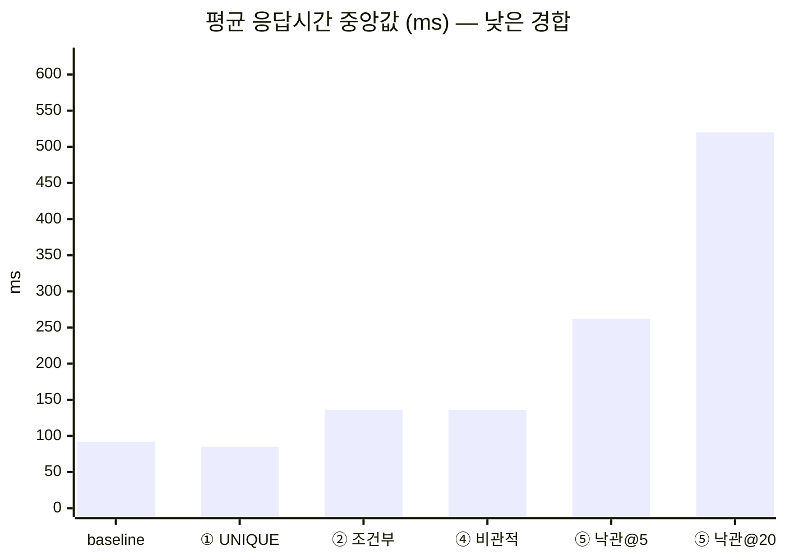
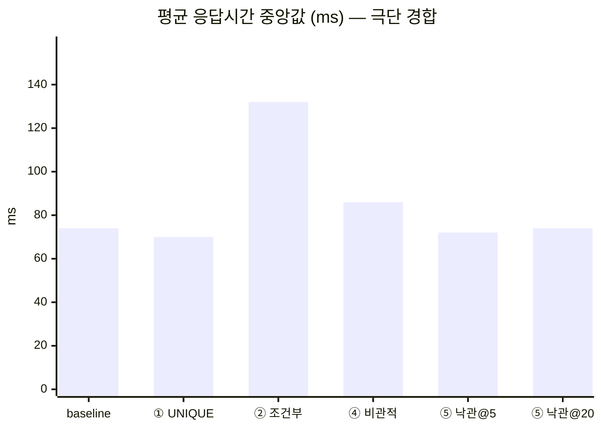

# 2단계 ⑦ 방어 전략 벤치마크 — 같은 부하, 통제된 설정

> 이 문서는 baseline·①·②·④·⑤를 같은 애플리케이션 설정에서 두 workload로 검증한 결과다.
> 2026-09-24의 60행은 **서로 다른 지원자의 정원 경쟁**, 2026-09-25의 25행은 **동일
> `(applicant, slot)` 재요청** 정본이다. 목적이 다른 두 결과를 한 성능 표로 합치지 않는다.
> 2026-09-04의 기본 프로필 결과는 설정 비용이 섞였으므로
> [아카이브](benchmark/archive/2026-09-04-manifest.md)로 보존하되 결론의 근거로 쓰지 않는다.

측정 자산:
[`raw-runs.csv`](benchmark/raw-runs.csv) (60행) ·
[통제 실행 기록](benchmark/2026-09-24-controlled-run.md) ·
[`duplicate-runs.csv`](benchmark/duplicate-runs.csv) (25행) ·
[동일 요청 실행 기록](benchmark/2026-09-25-duplicate-request-run.md) ·
[`scripts/benchmark.sh`](../scripts/benchmark.sh) ·
[`scripts/benchmark-duplicates.sh`](../scripts/benchmark-duplicates.sh) ·
[`scripts/validate_benchmark_environment.py`](../scripts/validate_benchmark_environment.py) ·
[`scripts/summarize_benchmark.py`](../scripts/summarize_benchmark.py) ·
[`scripts/duplicate_benchmark.py`](../scripts/duplicate_benchmark.py)

③(멱등성 키)과 ⑥(분산 락)은 도메인 전제가 맞지 않아 생략했으므로 측정 대상이 아니다
([③ 근거](STEP2-3-BRANCH-STRATEGY.md#skip-idempotency-key) ·
[⑥ 근거](STEP2-3-BRANCH-STRATEGY.md#skip-distributed-lock)).

---

## 1. 결론

1. **오버부킹을 막은 것은 ②④⑤다.** baseline과 ①은 극단 경합 5회 모두 정원 1에
   2~3건을 확정했다. ①의 UNIQUE는 중복 요청과 정원 경쟁이 서로 다른 문제임을 다시 보여준다.
2. **⑤는 상한을 어떻게 잡아도 대가가 크다.** 상한 5는 중앙값 기준 100석 중 13석만 채우고
   107건을 503으로 끝냈다. 상한 20은 100석을 채웠지만 응답 520ms·TPS 137.6으로,
   ②의 136ms·582.5 TPS보다 크게 느렸다.
3. **이번 통제 측정에서 ④의 성능은 ②보다 나쁘지 않았다.** 낮은 경합 중앙값은 둘 다 136ms였고
   짝비교는 ④ 3승·② 1승·동률 1, 극단 경합은 ④ 5승이었다. 따라서 ②의 최종 채택 근거는
   “항상 더 빠르다”가 아니라, 현재 불변식을 한 조건부 DML로 가장 직접적이고 작게 표현한다는
   도메인 적합성이다.
4. **실제 동일 요청 5,000건에서도 DB 예약은 실행마다 1건이었다.** 전역 UNIQUE는 다섯 경로 모두의
   중복 행과 추가 좌석 소모를 막았다. 다만 `/unique`만 995개의 중복 요청을 409로 번역했고,
   나머지 네 경로는 각 995건, 합계 3,980건을 500으로 반환했다. 데이터 안전성과 응답 의미는
   별도 계약이다.

## 2. 정원 경쟁 60회 — 어떻게 쟀나

| 축 | 값 |
|---|---|
| 전략 | `baseline` · `unique`(①) · `conditional`(②) · `pessimistic`(④) · `optimistic`(⑤, 상한 5·20) |
| 경합 | 낮음 `cap=100 cont=120` / 극단 `cap=1 cont=200` |
| 반복 | 각 조합 5회 — 총 60회 |
| 시나리오 | 슬롯 1개에 서로 다른 지원자 N명이 `atOnceUsers`로 동시 예약 |
| 환경 | macOS arm64 · Java 21.0.9 · Spring Boot 3.5.16 · Gatling 3.13.5.4 · MySQL 8.0.46 |
| 실행 위치 | Gatling·앱·MySQL이 노트북 1대에서 함께 실행 |

락마다 유리한 별도 시나리오를 만들지 않았다. 1단계 시나리오에서 `-Dstrategy`,
`-Dcapacity`, `-Dcontenders`만 바꿨다
([실험 통제 원칙](STEP2-3-BRANCH-STRATEGY.md#lock-experiment-control)).

### 2-1. 애플리케이션 설정도 실험 변수로 통제했다

기존 결과에는 HikariCP 기본 풀과 대량 SQL·예외 로그의 콘솔 I/O가 섞여 있었다. 전략마다 SQL 수와
실패 수가 다르므로, 이는 동일하지 않은 계측 비용이다. 새 측정은 전용 `benchmark` 프로필로 다음을
고정했다.

- Hikari maximum/minimum idle을 모두 100으로 고정하고, 실제 연결 100개가 준비된 뒤 시작한다.
- Hibernate `show_sql`·포맷·주석, SQL/bind logger와 root logger를 모두 끈다.
- 백오프는 exponential jitter, base 10ms, max 200ms로 고정한다.
- Phase A/B마다 실제 낙관적 락 상한이 각각 5/20인지 확인한다.
- 스크립트는 부하 전에 환경 API를 검증한다. 활성 프로필, 풀, 로그, 백오프, 상한 중 하나라도
  다르면 CSV를 만들기 전에 실패한다.

풀 100은 `capacity=100`의 쓰기가 커넥션 대기에서 먼저 직렬화되지 않게 하면서 MySQL
`max_connections=151`에 관리 연결 여유를 남긴 값이다. 정확한 실행 환경과 데이터 해시는
[통제 실행 기록](benchmark/2026-09-24-controlled-run.md)에 있다.

### 2-2. 실행 순서는 라운드 단위 인터리브

한 전략을 5회 몰아서 실행하지 않고, 라운드마다 다섯 전략을 한 번씩 실행했다. ②와 ④는 같은
라운드에서 연달아 실행되므로 장기 워밍업 편향을 줄인 짝비교가 가능하다.

다만 라운드 안의 순서는 항상
`baseline → unique → conditional → pessimistic → optimistic`이었다. 완전 무작위·회전 순서가
아니므로 남은 순서 효과는 이 실험의 한계다.

### 2-3. TPS와 정합성의 계산

Gatling 기본 RPS는 지원자 시드 시간까지 포함하므로 이 짧은 버스트에는 맞지 않는다. 표의 TPS는
`요청 수 ÷ 최대 응답시간`이다. 절대 용량이 아니라 같은 실행 환경 안의 상대 비교로만 읽는다.

오버부킹은 HTTP 응답이 아니라 실행별 슬롯의 확정 예약 수를 MySQL에서 직접 읽어 판단했다.
확정 예약·KO·응답시간·TPS는 5회의 중앙값, 응답시간 괄호는 min–max다. 오버부킹은 한 번이라도
발생하면 실패이므로 5회의 최댓값을 싣는다. 원시 CSV의 `duplicates`는 요청마다 다른 지원자를
사용해 구조적으로 0이므로 검증 지표나 결과 표에 쓰지 않는다.

### 2-4. 이 측정이 못 하는 것

- 노트북 한 대의 5회 측정이므로 범위가 겹치면 절대 우열로 일반화하지 않는다.
- 전략 순서가 라운드 안에서 고정돼 있다.
- 시작 시 DB에는 슬롯 184행·예약 6,863행이 누적돼 있었다. 슬롯 단위 정합성에는 영향이 없지만
  인덱스 크기는 절대 응답시간에 섞인다.
- baseline·①·⑤ 상한 5의 응답시간/TPS는 대량 KO가 포함된 값이다. 성공 처리 성능처럼 비교하면
  안 된다.
- ②의 만석 경로에는 404/409 구분용 `existsById`가 포함돼 있다. 이 조회를 제거한 A/B를 하지
  않았으므로 ②와 ④의 차이를 락 메커니즘 하나의 인과로 단정하지 않는다.

## 3. 정원 경쟁 결과

### 낮은 경합 `cap=100 cont=120`

| 전략 | 확정 예약 | 오버부킹 | KO(실패) | 평균 응답 (중앙값) | p95 | TPS | n |
|---|---|---|---|---|---|---|---|
| baseline (방어 없음) | 9 | 0 | **111** | 92 <sub>(74–336)</sub> | 131 | 857.1 | 5 |
| ① UNIQUE | 7 | 0 | **113** | 85 <sub>(72–90)</sub> | 108 | 1081.1 | 5 |
| ② 조건부 UPDATE | 100 | 0 | 0 | 136 <sub>(109–233)</sub> | 194 | 582.5 | 5 |
| ④ 비관적 락 | 100 | 0 | 0 | 136 <sub>(125–161)</sub> | 203 | 560.7 | 5 |
| ⑤ 낙관적 락 (상한 5) | 13 | 0 | **107** | 262 <sub>(240–296)</sub> | 316 | 364.7 | 5 |
| ⑤ 낙관적 락 (상한 20) | 100 | 0 | 0 | 520 <sub>(375–575)</sub> | 777 | 137.6 | 5 |

### 극단 경합 `cap=1 cont=200`

| 전략 | 확정 예약 | 오버부킹 | KO(실패) | 평균 응답 (중앙값) | p95 | TPS | n |
|---|---|---|---|---|---|---|---|
| baseline (방어 없음) | 3 | **2** | **10** | 74 <sub>(61–285)</sub> | 112 | 1652.9 | 5 |
| ① UNIQUE | 3 | **2** | **10** | 70 <sub>(67–124)</sub> | 106 | 1503.8 | 5 |
| ② 조건부 UPDATE | 1 | 0 | 0 | 132 <sub>(102–221)</sub> | 194 | 947.9 | 5 |
| ④ 비관적 락 | 1 | 0 | 0 | 86 <sub>(72–90)</sub> | 120 | 1470.6 | 5 |
| ⑤ 낙관적 락 (상한 5) | 1 | 0 | 0 | 72 <sub>(70–77)</sub> | 105 | 1639.3 | 5 |
| ⑤ 낙관적 락 (상한 20) | 1 | 0 | 0 | 74 <sub>(63–98)</sub> | 107 | 1639.3 | 5 |

### 3-1. ①은 오버부킹을 막지 못한다

극단 경합에서 baseline과 ①은 5회 모두 정원 1에 2~3건을 확정했다. ①의 UNIQUE는
`(applicant_id, slot_id)` 중복을 막지만, 이 부하는 서로 다른 지원자끼리 경쟁하므로 같은 키가
없다. ①과 ②는 대체재가 아니라 서로 다른 불변식을 맡는 직교 방어다.

과거 표의 `중복 0`은 이 부하가 서로 다른 지원자만 써서 나온 값이지, ①을 검증한 수치가 아니었다.
그래서 위 표에서 해당 열을 제거하고, 같은 지원자의 실제 HTTP 동시 재요청을 다음 별도 workload로
검증했다.

### 3-1-1. 동일 요청 25회 — DB 안전성과 HTTP 의미

각 실행에서 정원 200 슬롯과 지원자 한 명을 새로 만든 뒤 같은 `(applicantId, slotId)` body를
`atOnceUsers(200)`으로 보냈다. 다섯 전략을 실행 위치별로 한 번씩 놓는 순환 순서로 각 5회 실행했다.

| 경로 | 실행 | 201 | 409 | 500 | 503 | 기타/무응답 | DB 불변식 |
|---|---:|---:|---:|---:|---:|---:|---|
| baseline | 5 | 5 | 0 | 995 | 0 | 0 | **PASS** |
| ① UNIQUE | 5 | 5 | **995** | 0 | 0 | 0 | **PASS** |
| ② 조건부 UPDATE | 5 | 5 | 0 | 995 | 0 | 0 | **PASS** |
| ④ 비관적 락 | 5 | 5 | 0 | 995 | 0 | 0 | **PASS** |
| ⑤ 낙관적 락 | 5 | 5 | 0 | 995 | 0 | 0 | **PASS** |

여기서 `PASS`는 매 실행마다 `confirmed=1`, 동일 pair 예약 행 1개, `remaining=199`, 중복 행 0,
좌석 소모 1개를 모두 만족했다는 뜻이다. `duplicate_rows=0`만 보지 않으므로 예약이 아예 0건인
실패는 통과할 수 없다.

V2 UNIQUE는 테이블 전역 제약이라 모든 경로에서 데이터를 지켰다. 반면 UNIQUE 위반을
`DuplicateReservationException`으로 번역하는 코드는 `/unique`에만 있어, 나머지는 중복 199건을
500으로 반환했다. 따라서 **중복 행 방어는 검증됐지만 최종 `/conditional`의 재요청 응답 계약은
아직 미완성**이다. 원시 25행은 [`duplicate-runs.csv`](benchmark/duplicate-runs.csv)에 있다.

### 3-2. 낮은 경합의 오버부킹 0은 방어 성공이 아니다

baseline과 ①의 확정 예약 중앙값은 100석 중 9석과 7석뿐이고, KO 중앙값은 111건과 113건이다.
넘칠 만큼 요청이 커밋되지 못한 것이다. 이 경로의 FK 공유→배타 락 승격 데드락은
[1단계](STEP1-BASELINE-OVERBOOKING.md#5-왜-http-500이-77나왔나--fk-잠금-승격-데드락)가 이미
원인을 재현했다. 새 프로필은 성능 오염을 막으려고 root 로그를 끄므로 이번 60행에는 로그 건수를
별도 지표로 싣지 않는다.

극단 경합에서는 정원 1이 빠르게 소진돼 대부분이 409로 빠져나가므로 승격 경쟁 참여자가 줄고,
가려져 있던 오버부킹이 드러난다. 두 경합 지점을 함께 봐야 하는 이유다.

### 3-3. ⑤ 상한 5의 KO는 의도된 503이다

⑤ 상한 5의 낮은 경합 KO 107건은 재시도 통계의 `retryExhausted=107`과 일치하고,
`deadlocks=0`이다. baseline·①의 처리되지 않은 DB 실패와 달리, ⑤가 유한 상한을 지키며
“현재 경합에서는 완료하지 못했다”고 503으로 거절한 결과다.

## 4. 성능 — 한눈에





baseline·①의 짧은 응답은 대부분이 일찍 실패한 결과라 채택 후보와 비교할 수 없다. ⑤의 극단
경합이 빠른 이유도 슬롯 쓰기가 한 번뿐이라 재시도가 거의 없기 때문이다. 정합성과 가용성이 같은
②·④·⑤ 상한 20만 놓으면, 낮은 경합에서는 ②와 ④가 같은 중앙값이고 ⑤ 상한 20은 크게 느리다.
극단 경합에서는 ④가 ②보다 빠르다.

## 5. ⑤ 낙관적 락이 치르는 비용

### 5-1. 재시도 통계

| 상한 | 경합 | 성공 | 재시도 소진(503) | 버전 충돌 | 데드락 | 성공당 평균 시도 |
|---|---|---|---|---|---|---|
| 5 | 낮음 `cap=100` | 13 | 107 <sub>(105–109)</sub> | 566 <sub>(561–571)</sub> | 0 | 3.4 |
| 5 | 극단 `cap=1` | 1 | 0 <sub>(—)</sub> | 14 <sub>(11–18)</sub> | 0 | 1 |
| 20 | 낮음 `cap=100` | 100 | 0 <sub>(—)</sub> | 735 <sub>(666–767)</sub> | 0 | 6.7 |
| 20 | 극단 `cap=1` | 1 | 0 <sub>(—)</sub> | 11 <sub>(9–13)</sub> | 0 | 1 |

“낮은/극단 경합”은 ⑤에게 반대로 읽힌다. 낙관적 락의 충돌량은 동시 요청 수보다 같은 슬롯 행에
성공적으로 쓰는 횟수에 좌우된다. `cap=100`은 성공적 쓰기 100번이라 가장 어렵고,
`cap=1`은 한 번만 쓰면 나머지가 만석으로 빠져나가 가장 쉽다.

### 5-2. 상한 5와 20

| 상한 | 자리를 채우는가 | 대가 |
|---|---|---|
| 5 | ❌ 중앙값 13/100석, 107건 503 | 응답 262ms / TPS 364.7 |
| 20 | ✅ 100/100석, 503 0건 | 응답 520ms / TPS 137.6 |

상한을 올리면 가용성은 회복하지만 재시도 비용이 커진다. 상한 20 마지막 낮은 경합 실행의
[전체 분포](benchmark/optimistic-attempt-distribution-cap20.json)는 다음과 같다.

```text
시도  1:3  2:1  3:1  4:2  5:3  6:26  7:30  8:15  9:11  10:5  11:2  12:1
                                      6회 이상 필요: 90건
성공 100 · 소진 0 · 버전 충돌 767 · 성공당 평균 7.0회
```

이 독립 실행에서 성공 100건 중 90건이 6회 이상 필요했다. 이를 상한 5 실행의 정확한 반사실로
간주할 수는 없지만, 상한 5에서 대량 소진이 발생한 방향과 원인을 뒷받침한다. ②·④에는 이에
대응하는 재시도 상한 튜닝이 없다.

<a id="conditional-vs-pessimistic"></a>
## 6. ②와 ④ — 새 측정이 기존 가설을 뒤집었다

### 6-1. 라운드별 짝비교 (평균 응답, ms)

| 경합 | 라운드 | ② 조건부 | ④ 비관적 | 차(②−④) | 빠른 쪽 |
|---|---|---|---|---|---|
| 낮음 | 1 | 233 | 161 | +72 | **④** |
| 낮음 | 2 | 127 | 125 | +2 | **④** |
| 낮음 | 3 | 136 | 136 | +0 | **동률** |
| 낮음 | 4 | 109 | 142 | -33 | **②** |
| 낮음 | 5 | 136 | 125 | +11 | **④** |
| **낮은 경합 합계** | | | | | **② 1승 / ④ 3승 / 동률 1** |
| 극단 | 1 | 135 | 90 | +45 | **④** |
| 극단 | 2 | 102 | 82 | +20 | **④** |
| 극단 | 3 | 125 | 86 | +39 | **④** |
| 극단 | 4 | 132 | 72 | +60 | **④** |
| 극단 | 5 | 221 | 86 | +135 | **④** |
| **극단 경합 합계** | | | | | **② 0승 / ④ 5승** |

이전 비통제 측정은 낮은 경합에서 ②가 5/5 이겼다고 기록했다. 풀과 로그를 통제하자 그 결과는
재현되지 않았다. 낮은 경합 중앙값은 136ms로 같고, 짝비교는 오히려 ④ 쪽으로 기울었다.
이것이 기존 데이터를 아카이브하고 새 60행만 정본으로 삼는 이유다.

### 6-2. 쿼리 수는 극단 경합을 설명하는 가설이지 확정된 인과가 아니다

| 경로 | ② 조건부 | ④ 비관적 |
|---|---|---|
| 성공(자리 있음) | 3 | 4 |
| 거절(만석) | 3 | 2 |

②는 조건부 UPDATE가 0행일 때 없는 슬롯(404)과 만석(409)을 구분하려고 `existsById`를 한 번 더
호출한다. `cap=1`에서 199건이 거절되므로 극단 경합의 ④ 우위와 방향이 맞는다. 그러나 해당 조회만
제거한 A/B를 하지 않았고, 이 설명만으로는 낮은 경합의 짝비교 결과도 설명하지 못한다. 따라서
“락이 본질적으로 더 빠르다”거나 “`existsById` 하나가 전부다”라고 단정하지 않는다.

### 6-3. 그래도 ②를 선택하는 이유

이번 결과만 보면 ④는 유효한 후보이며 성능 열세라고 부를 수 없다. 그 사실을 숨기지 않는다.
그럼에도 현재 도메인의 정본 구현은 ① UNIQUE + ② 조건부 UPDATE로 유지한다.

- 지켜야 할 불변식이 `remaining > 0`인 단일 행·단일 산술 변경이라, 조건과 변경을 한 DML로
  직접 표현할 수 있다.
- ②는 슬롯 엔티티를 읽어 애플리케이션에서 검사·감소하는 임계 구역을 만들지 않는다.
- 정합성·가용성은 ④와 같고, 낮은 경합 응답 중앙값도 136ms로 같다.
- 명시적 `SELECT ... FOR UPDATE`를 기본값으로 삼으면 향후 서비스 로직이 그 잠금 구간 안으로
  쉽게 늘어날 수 있다. 현재 문제에는 그 확장된 임계 구역이 필요 없다.

따라서 선택 근거는 “②가 더 빠르다”가 아니라 **같은 불변식을 더 작은 상태 전이로 표현한다**는
점이다. 반대로 실제 운영 트래픽이 만석 거절 중심이고 극단 경합 지연이 핵심 SLO라면, 이번 수치는
④를 다시 후보에 올릴 근거가 된다. 그때는 ②의 `existsById` A/B와 더 많은 반복을 먼저 수행한다.

## 7. 최종 판단

| | 정원 경쟁의 오버부킹 | 동일 요청(DB / HTTP) | 자리를 다 채우는가 | 튜닝 손잡이 | 판단 |
|---|---|---|---|---|---|
| baseline | ❌ 발생 | ✅ 행 1건 / ❌ 500 | ❌ (대량 KO) | — | 재현 자산 |
| ① UNIQUE | ❌ 발생 | ✅ 행 1건 / ✅ 409 | ❌ | 없음 | **유지** — 중복 전용 |
| ② 조건부 UPDATE | ✅ 0 | ✅ 행 1건 / ❌ 500 | ✅ | 없음 | **채택** — 현재 정원 불변식의 가장 작은 표현 |
| ④ 비관적 락 | ✅ 0 | ✅ 행 1건 / ❌ 500 | ✅ | 없음 | 미채택, 단 성능상 유효 후보 |
| ⑤ 낙관적 락 | ✅ 0 | ✅ 행 1건 / ❌ 500 | 상한에 따라 | 상한·백오프 | 미채택 — 재시도 비용과 503 |

최종 구성은 **① UNIQUE(중복) + ② 조건부 UPDATE(정원)**다. ④를 미채택한 이유를 성능 우위로
포장하지 않는다. 통제된 측정에서는 ④가 같거나 빨랐고, ②는 이 도메인의 불변식을 가장 직접적으로
표현한다는 설계 기준으로 선택했다. ⑤는 측정한 두 상한에서 가용성이나 성능 중 하나를 잃었다.

## 8. 남은 후속 과제

- ②의 만석 경로에서 `existsById`를 제거하거나 응답 계약을 바꾼 뒤 ②/④ A/B를 별도 데이터셋으로
  측정한다.
- 라운드별 전략 순서를 회전하거나 무작위화하고 반복 수를 늘려 순서 효과와 분산을 줄인다.
- 정원 경쟁 CSV에도 HTTP 상태별 건수와 실행 환경 식별자를 직접 기록해 KO의 원인을 원시 행에서
  추적 가능하게 만든다. 동일 요청 CSV에는 이미 상태별 건수가 있다.
- 최종 `/conditional` 경로의 중복 요청을 `200 + 기존 예약`으로 번역하는 API 응답 과제를
  ① UNIQUE 위에서 해결한다.

## 9. 재현

기존 정본에 append하지 않도록 별도 출력 파일을 사용한다.

```bash
docker compose up -d
BENCHMARK_DIR=$(mktemp -d)
BENCHMARK_CSV="$BENCHMARK_DIR/raw-runs.csv"
BENCHMARK_DISTRIBUTION="$BENCHMARK_DIR/optimistic-cap20.json"

./gradlew bootRun --args='--spring.profiles.active=benchmark'
OUT_CSV="$BENCHMARK_CSV" \
  ATTEMPT_DISTRIBUTION_JSON="$BENCHMARK_DISTRIBUTION" \
  scripts/benchmark.sh --phase a --rounds 5

# 첫 앱을 종료하고 8080 포트가 닫힌 뒤 새 JVM으로 실행
./gradlew bootRun \
  --args='--spring.profiles.active=benchmark --reservation.optimistic.max-attempts=20'
OUT_CSV="$BENCHMARK_CSV" \
  ATTEMPT_DISTRIBUTION_JSON="$BENCHMARK_DISTRIBUTION" \
  scripts/benchmark.sh --phase b --rounds 5

python3 scripts/summarize_benchmark.py "$BENCHMARK_CSV"

# 동일 요청 검증은 상한 5 benchmark 앱에서 별도 실행한다. 정본 경로가 이미 있으면 덮어쓰지 않는다.
scripts/benchmark-duplicates.sh
python3 scripts/duplicate_benchmark.py summarize docs/benchmark/duplicate-runs.csv --rounds 5
```

스크립트는 각 Phase 시작 전에 활성 프로필·풀 100개 준비·모든 로그 OFF·백오프·재시도 상한을
검증한다. 정원 경쟁 결과는 60행이어야 하며 각 `(전략, 상한, 경합)` 조합이 정확히 5행인지
확인한다. 동일 요청 결과는 25행이어야 하고 각 전략이 각 실행 위치에 한 번씩 놓이며, 모든 행의
HTTP 합계와 DB 불변식이 통과해야 한다.
